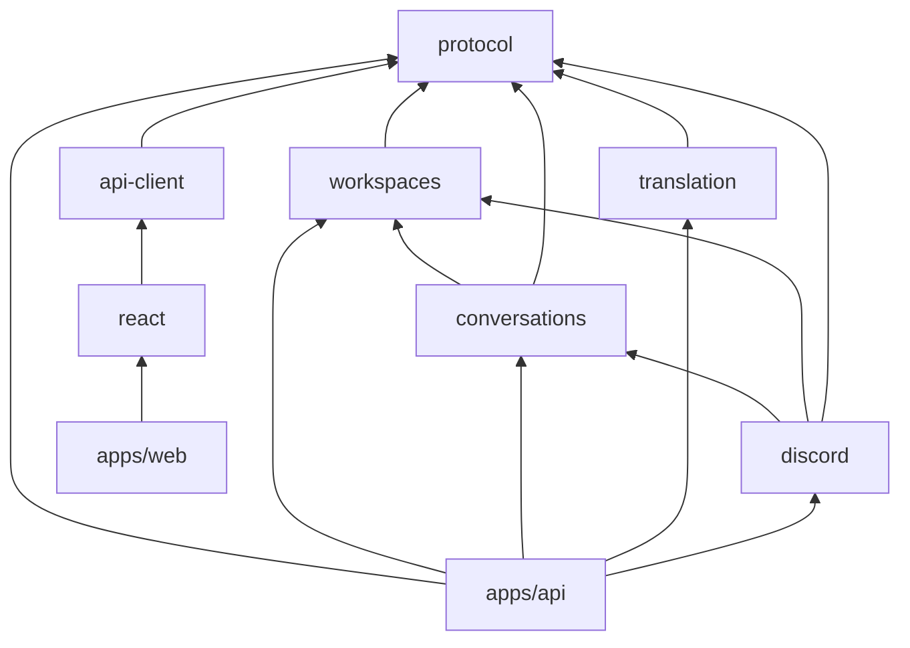
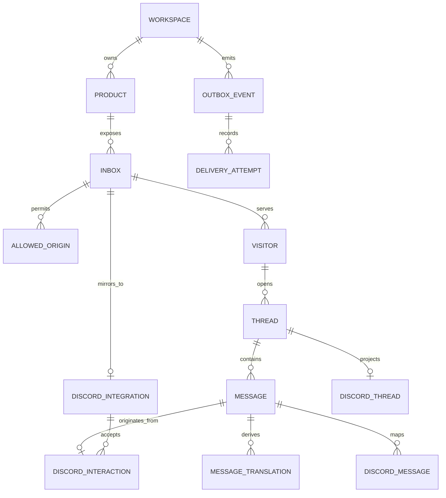

# Agent Chat base architecture v1

Status: final proposal for review; no implementation started
Last updated: 2026-08-25
Scope: pnpm/TypeScript monorepo, React customer widget, D1 chat storage, Gemini translation, and Discord as the complete operator interface

## Decisions requested

This is the final candidate architecture before implementation.

1. Discord is the only operator UI. Operators reply with a guild-scoped `/reply message:<English text>` command inside the mapped support thread. There is no Better Auth dependency, magic-link flow, operator web app, or authenticated admin API.
2. Workspace, product, inbox, origin, and Discord-channel configuration live in D1 and are applied by a local Wrangler-authenticated bootstrap command.
3. D1 is the canonical store. The customer widget uses optimistic updates plus a two-second cursor poll; there is no per-thread Durable Object or customer WebSocket.
4. V1 has no Durable Objects. Discord sends signed command interactions to the HTTP Worker, while outgoing forum/thread/message operations use Discord REST.
5. `apps/web` is only a widget playground and E2E host. Canto imports `@agent-chat/react` directly. Only `apps/web` and `apps/api` build; functional packages export TypeScript source.

## Runtime architecture

```mermaid
flowchart LR
  Bootstrap[Local config bootstrap<br/>Wrangler-authenticated]

  subgraph Customer[Customer surface]
    Canto[Canto Transcriber]
    Widget[@agent-chat/react]
    Canto --> Widget
  end

  subgraph ApiApp[apps/api — one Wrangler bundle]
    HTTP[Hono HTTP API<br/>widget + signed interactions]
    Jobs[Queue consumers +<br/>scheduled outbox re-driver]
  end

  subgraph Cloudflare[Managed data and delivery]
    D1[(D1 canonical database)]
    Queues[[Cloudflare work queues + DLQ]]
  end

  Discord[Discord forum channel<br/>one post per support thread]
  Gemini[Gemini 3.1 Flash-Lite]

  Bootstrap -->|non-secret workspace topology| D1
  Widget -->|append + cursor poll| HTTP
  Discord -->|signed POST /reply interaction| HTTP
  HTTP -.->|after D1 commit: queued acknowledgement| Discord
  HTTP -->|transactional batch| D1
  HTTP -.->|waitUntil fast path| Queues
  Queues --> Jobs
  Jobs <-->|load state; commit result + next outbox| D1
  Jobs -->|CAS-claim pending or expired outbox| D1
  Jobs -.->|re-publish outbox reference| Queues
  Jobs <-->|context-aware translation| Gemini
  Jobs -->|create thread; post messages + receipts via REST| Discord
```

The entire runtime is one stateless Worker bundle plus managed D1 and Queues. On the normal interaction path, the handler performs only signature verification, authorization, and one small D1 batch before acknowledging Discord; translation and Discord REST delivery stay off its three-second response path.

`DISCORD_BOT_TOKEN`, `GEMINI_API_KEY`, and the widget-token signing key are Worker secrets. `DISCORD_APPLICATION_ID` and `DISCORD_PUBLIC_KEY` are non-secret Worker configuration used to validate interactions. The bootstrap command never writes secrets into D1.

## Discord: REST projection and signed HTTP interactions

Discord's bot REST API can manipulate forum posts, threads, and their messages:

| Operation | REST support |
| --- | --- |
| Create a forum post | Create a public thread and its starter message with `POST /channels/{forum_id}/threads`. |
| Read/update a thread | Get or patch its name, archived/locked state, slow mode, and applied tags. |
| Discover threads | List active guild threads and public/private/joined archived threads. |
| Read messages | Page 1–100 messages with `after`, `before`, or `around` cursors. |
| Reply | Treat the thread ID as a channel ID and post a message. Posting automatically unarchives an archived thread. |
| Edit/delete/react/pin | Edit bot-authored messages, delete with permission, and manage reactions or pins. |

See Discord's [thread model](https://docs.discord.com/developers/topics/threads), [channel/thread API](https://docs.discord.com/developers/resources/channel), and [message API](https://docs.discord.com/developers/resources/message).

### The `/reply` command

Register this as a guild-scoped Chat Input command so changes apply immediately:

```json
{
  "name": "reply",
  "type": 1,
  "description": "Reply to the customer in this support thread",
  "default_member_permissions": "0",
  "options": [
    {
      "name": "message",
      "description": "English reply to send to the customer",
      "type": 3,
      "required": true,
      "min_length": 1,
      "max_length": 6000
    }
  ]
}
```

`default_member_permissions: "0"` makes the command administrator-only by default. Discord Integration settings may later expose it to selected users or roles, but the Worker always enforces its own configured operator user/role allowlist.

The operator needs Use Application Commands and access to the thread. For REST projection, the bot needs View Channel, Send Messages on the forum (Discord ignores Create Public Threads for forum posts), Send Messages in Threads, and Read Message History for reconciliation. Add Reactions is granted only if used; Manage Threads is needed only for locked-thread recovery or moderation. No Gateway intents are required. See [Discord permissions](https://docs.discord.com/developers/topics/permissions).

For a forum post, the interaction's `channel_id` is the Discord thread ID. The handler requires an exact stored thread mapping and also validates the expected application, guild, public-thread channel type, forum `parent_id`, and operator user/roles. Invocations in the forum parent or an unmapped thread receive an ephemeral error.

The HTTP path is:

1. Require `X-Signature-Ed25519` and `X-Signature-Timestamp`. Before JSON parsing, verify the hex-decoded signature against the exact UTF-8 bytes of `timestamp + unmodifiedRawBody`; missing, malformed, invalid, or requests outside a bounded freshness window (five minutes by default) return 401.
2. Answer Discord's signed `PING` with `PONG`.
3. Parse and authorize `/reply`, then atomically insert the interaction receipt, English operator message, thread activity, and translation outbox event in D1. Message and event IDs derive deterministically from the interaction ID; a conflict loads the previously accepted result rather than reporting a false failure.
4. After the D1 commit, return an ephemeral type-4 (`flags: 64`) “Queued” response within Discord's three-second deadline. A failed commit returns an ephemeral failure instead of claiming success. Target a two-second p99; do not call Gemini, Discord REST, or a Queue consumer on this synchronous path.
5. Use `ctx.waitUntil` only to publish the already-committed outbox reference, with explicit error logging. A one-minute scheduled scan republishes pending events or events whose publishing lease expired.
6. After the translated reply is durable and available in customer chat, post a bot-authored “Available in chat” audit receipt containing the normalized English reply back into the Discord thread through REST.

The normal inline acknowledgement does not retain Discord's 15-minute interaction token. As a deadline fallback, if the already-started D1 batch has not settled by an internal cutoff below three seconds, return an ephemeral type-5 defer and attach the idempotent batch, best-effort Queue publish, and response edit to [`ctx.waitUntil`](https://developers.cloudflare.com/workers/runtime-apis/context/#waituntil). The short-lived continuation edits the original response to Queued or Failed; the token is never written to D1 or Queues. Richer asynchronous progress would require explicit short-lived sensitive-token handling.

Discord message content is limited to 2,000 characters even though the command string option permits 6,000. Audit projection therefore uses deterministic chunks of at most 2,000 characters, each with its own deterministic nonce of at most 25 characters. Every forum starter, translated customer message, and audit receipt containing user-derived text sets `allowed_mentions: { parse: [] }`.

See Discord's [interaction overview](https://docs.discord.com/developers/interactions/overview), [receiving and responding rules](https://docs.discord.com/developers/interactions/receiving-and-responding), and [application-command schema](https://docs.discord.com/developers/interactions/application-commands). Cloudflare Web Crypto supports [Ed25519 verification](https://developers.cloudflare.com/workers/runtime-apis/web-crypto/).

Ordinary typed Discord messages, `@bot` mentions, edits, deletes, reactions, and manually created forum posts are deliberately not input surfaces in v1. Without a Gateway they are not observed or ingested by Agent Chat. A future `/note` command, Reply button, or modal still works through the same HTTP interaction endpoint and does not require a socket.

## Why v1 has no Durable Objects

D1 and Queues cover every current persistence and coordination need:

- `D1Database.batch()` atomically writes a message, thread activity, interaction receipt, and outbox event. See [D1 batch](https://developers.cloudflare.com/d1/worker-api/d1-database/#batch).
- Every message has an opaque public ID and a D1 `INTEGER PRIMARY KEY AUTOINCREMENT` cursor. The widget pages by `(thread_id, row_id)` and polls every two seconds only while visible.
- Queues are at-least-once and unordered. Deterministic event IDs and unique constraints make consumers idempotent; Queue delivery never defines chat order. See [Queue delivery guarantees](https://developers.cloudflare.com/queues/reference/delivery-guarantees/).
- Every consumer transaction stores its result and the next-stage outbox event together; translation, Discord projection, customer-ready state, and audit projection have no store-then-enqueue gap.
- Outbox state is monotonic: `pending -> publishing(lease) -> published -> completed | dead`. All transitions are conditional. Consumers may complete a `publishing` or `published` event, while a late publisher can mark `published` only if its lease still matches, so it cannot regress `completed`.
- The scheduled outbox re-driver is stateless. It claims pending or expired publishing leases with a D1 compare-and-set and republishes references; crash-after-accept duplicates are safe.
- Exhausted Queue retries go to a dead-letter queue whose consumer records the final attempt and conditionally marks the event `dead`. Manual retry can explicitly return it to `pending`.
- Discord operator input is an ordinary signed HTTP request. There is no long-lived socket, presence, sequence, or ephemeral shared state.

Do not enable D1 read replication initially. If it is enabled later, use D1 Sessions/bookmarks to preserve sequential consistency. See [D1 read replication](https://developers.cloudflare.com/d1/best-practices/read-replication/).

### Later triggers for a Durable Object

Reconsider a DO only when one of these becomes a real requirement:

- ordinary Discord messages, mentions, edits, reactions, or manually created threads must become inputs, requiring a persistent Gateway connection;
- sub-second cross-client delivery, typing, or presence becomes a requirement;
- roughly 100+ simultaneously open widgets make two-second polling a material D1 baseline;
- multiple live responders need immediate exclusive ownership beyond a D1 conditional lease;
- a hot thread needs serialized ephemeral state shared by several clients.

D1 remains canonical even if a later DO provides coordination or realtime fanout.

## Monorepo and build boundary

```text
agent-chat/
  apps/
    web/                            Vite widget playground and browser/E2E host
      src/main.tsx                  mounts the real @agent-chat/react package
      vite.config.ts
      package.json
    api/                            sole deployed Worker application
      src/index.ts                  fetch + queue + scheduled entrypoint
      src/http.ts                   Hono route composition
      src/db.ts                     drizzle(env.DB)
      src/queue.ts                  work-queue/DLQ dispatch and orchestration
      src/scheduled.ts              outbox recovery and retention
      scripts/config-apply.ts       validates config and drives Wrangler D1
      scripts/discord-register.ts   registers guild application commands
      migrations/                   one reviewed D1 SQL ledger
      drizzle.config.ts
      wrangler.jsonc
      package.json
  packages/
    protocol/                       DTO/runtime schemas, events, IDs, errors
      src/index.ts
    api-client/                     source TypeScript customer fetch client
      src/index.ts
    react/                          customer widget components and hooks
      src/index.ts
      src/styles.css
    workspaces/                     workspace/product/inbox/origin component
      src/schema.ts
      src/index.ts
    conversations/                  visitor/thread/message/translation/outbox
      src/schema.ts
      src/index.ts
    translation/                    Gemini adapter, masking, prompt validation
      src/index.ts
    discord/                        Discord integration component
      src/commands.ts               canonical /reply command definition
      src/interactions.ts           signatures, parsing, authorization
      src/rest.ts                   thread/message REST adapter
      src/schema.ts                 integration and external-ID mappings
      src/index.ts
  config/
    workspaces.example.json         non-secret topology template
  docs/
  package.json
  pnpm-workspace.yaml
  pnpm-lock.yaml
  tsconfig.base.json
```

Each directory under `packages/` has its own `package.json`, `tsconfig.json`, colocated tests, and public `src/index.ts`; repeated files are omitted from the tree for readability.

There is no `packages/auth`. There is also no generic `packages/database`: `apps/api` owns `drizzle(env.DB)`, Drizzle configuration, and the checked-in D1 migration ledger. Each persisted functional package owns its `schema.ts` and queries; the API's Drizzle config includes those schema paths. The transactional outbox is part of `conversations`, because message mutation and event creation must be one feature-owned D1 batch rather than a transaction leaked into the composition root.

`conversations` wholly owns customer-message append transactions. For the cross-feature operator path, `discord.acceptReply(db, input)` owns the transaction: it combines its interaction-receipt statement with message/outbox statements prepared by `conversations`, then executes one D1 batch. `apps/api` calls the service but never assembles persistence statements.

Only application packages expose `build`:

- `apps/web` bundles a tiny page that mounts the real widget for development and E2E testing. It is not a dashboard and is not on Canto's production request path.
- `apps/api` lets Wrangler bundle the HTTP, Queue, and scheduled handlers together.
- Feature packages expose `typecheck` and `test`, but no `build`, `dist`, or generated JavaScript.
- Canto consumes the publishable source packages (`protocol`, `api-client`, and `react`) and compiles them in its own Vite build.
- The root, both apps, and the server-only `workspaces`, `conversations`, `translation`, and `discord` packages are `private: true`. Only `protocol`, `api-client`, and `react` are publishable.

### Package dependency graph



`apps/api` is the composition root. Translation and Discord adapters do not orchestrate each other. Queue handlers invoke packages in the required order, keeping feature dependencies acyclic and independently testable.

Private app/server edges use `workspace:*`. The publishable client chain uses `workspace:^` so pnpm rewrites it to caret semver ranges when packed. Public packages include their source so Canto can consume them outside this monorepo. An abridged but dependency-complete React manifest is:

```json
{
  "name": "@agent-chat/react",
  "version": "0.1.0",
  "type": "module",
  "files": ["src"],
  "exports": {
    ".": {
      "types": "./src/index.ts",
      "default": "./src/index.ts"
    },
    "./styles.css": "./src/styles.css"
  },
  "dependencies": {
    "@agent-chat/api-client": "workspace:^"
  },
  "peerDependencies": {
    "react": ">=18"
  },
  "scripts": {
    "typecheck": "tsc --noEmit",
    "test": "vitest run"
  }
}
```

`@agent-chat/api-client` likewise declares its direct `@agent-chat/protocol` dependency; no package relies on a transitive import or workspace hoisting.

Use strict ESM TypeScript with `moduleResolution: "Bundler"`, `verbatimModuleSyntax`, and no emit. Do not use path aliases for package names; they can hide undeclared dependencies. Wrangler and Vite both follow the `.ts` exports and perform the only production builds. See [pnpm workspaces](https://pnpm.io/workspaces) and [Wrangler bundling](https://developers.cloudflare.com/workers/wrangler/bundling/).

## Workspace configuration without a control plane

Discord channel permissions are the human operator boundary; Cloudflare account access is the configuration boundary.

An idempotent local command such as `pnpm config:apply --env production` will:

1. validate a local non-secret config file with the same runtime schemas used by the API;
2. run the checked-in D1 migrations through Wrangler;
3. generate parameter-safe, idempotent seed SQL for the workspace, product, inbox, allowed origins, Discord guild/forum IDs, and allowed Discord user/role IDs;
4. execute that temporary SQL with `wrangler d1 execute --remote --file`;
5. print the public widget installation ID needed by Canto.

The Node script does not receive an `env.DB` binding. It reuses the config/domain schemas, then delegates remote database access to the Wrangler CLI authenticated by the developer's Cloudflare credentials. It does not create an unauthenticated admin HTTP route. Secrets are installed separately with `wrangler secret put` and local uncommitted dev vars.

`packages/discord/src/commands.ts` owns the canonical command definitions. The unbuilt `apps/api/scripts/config-apply.ts` and `discord-register.ts` run through `tsx`, declared by `apps/api`. The config script imports both workspace and Discord config schemas; the registration script applies guild-scoped commands through Discord REST using a local uncommitted bot token. These remain setup scripts, not another package or build target.

This is intentionally operationally simple for one owner while preserving the product model. A future control plane can retain the schema and validation model, then use the D1-bound workspace repository inside the Worker.

## D1 model



Key constraints:

- There are no user, session, account, verification, or workspace-membership tables in v1.
- Every product-owned row carries `workspace_id` directly or through an enforced composite relation. Worker queries never infer a workspace from untrusted client input.
- An inbox has an opaque public installation ID, allowed origins, and one Discord forum destination.
- Visitors store the app-supplied external user ID, email, PostHog distinct ID, locale, and bounded metadata. IP-derived region and user agent are observational context, not authentication.
- Client-supplied identity/context is advisory unless Canto later signs it server-side.
- `message.row_id` is the committed internal cursor; `message.id` is a public opaque ID.
- Unique `(thread_id, client_message_id)` deduplicates widget retries.
- Unique `(discord_integration_id, interaction_id)` deduplicates Discord interaction retries.
- Operator message and initial outbox IDs derive from the interaction ID; conflict-safe inserts return the already accepted result on Discord retries.
- Discord interaction receipts retain the application, guild, thread, operator, command, and normalized option values, but never the short-lived interaction token.
- Discord message mappings remain for bot-authored REST projection and ambiguous-response reconciliation.
- Unique `(message_id, target_language, prompt_version)` deduplicates translations.
- Outbox events have deterministic IDs and conditional states `pending | publishing | published | completed | dead`; publishing rows carry attempt and lease metadata.
- The Discord bot token and Gemini key never appear in these tables.

## Message flows

### Customer to Discord

1. Canto supplies product context to the widget; the widget exchanges its public installation ID and allowed Origin for a short-lived, inbox-bound customer token.
2. The widget posts original text with that token and a `client_message_id`.
3. One D1 batch inserts the message, advances thread activity, and inserts a translation outbox event.
4. The API returns the committed message immediately. `waitUntil` publishes a reference to a Queue; a scheduled re-driver catches any stranded outbox row.
5. The translation consumer reloads bounded thread context, calls Gemini, and validates protected URLs/code/identifiers. One D1 batch stores the English variant and its Discord-delivery outbox event.
6. The Discord consumer creates or locates the mapped forum thread and posts the translated English message through REST. Normal message sends use a deterministic Discord `nonce` with `enforce_nonce: true`; ambiguous responses are reconciled before retry.
7. Forum-thread creation has no equivalent nonce guarantee, so the starter message carries a deterministic correlation marker. A delivery lease plus recent-thread reconciliation finds a success whose HTTP response was lost before creating another post.
8. The widget cursor poll observes resulting delivery state.

### Discord to customer

1. Simon invokes `/reply message:<English text>` inside the mapped Discord thread.
2. The HTTP Worker verifies the raw-body Ed25519 signature, application/guild/thread mapping, forum parent, and configured operator user/roles.
3. One D1 batch idempotently inserts the interaction receipt, English operator message, thread activity, and translation outbox event keyed by the Discord interaction ID.
4. The endpoint returns an ephemeral “Queued” response within three seconds, then `waitUntil` attempts Queue publication; the scheduled outbox scan is the durable fallback.
5. Gemini translates the reply to the thread's persisted customer language. One D1 batch stores the translation, marks it available in customer chat, and inserts the Discord-audit outbox event.
6. The open widget discovers the reply on its next cursor poll.
7. The Discord audit consumer posts a bot-authored “Available in chat” receipt containing the normalized English reply in the thread through REST, chunked if necessary and using deterministic short nonces plus reconciliation on ambiguous responses.

Ordinary messages typed into the Discord thread are not observed or ingested in v1.

Queue payloads are references or bounded normalized events, never the authority. Consumers acknowledge only after resulting D1 state is durable.

## API surface

Customer widget:

- `POST /v1/client/sessions`
- `POST /v1/threads`
- `GET /v1/threads/{threadId}/messages?after={cursor}`
- `POST /v1/threads/{threadId}/messages`

Discord/runtime:

- `POST /v1/discord/interactions` — signed `PING`, `/reply`, and later `/note`/button/modal ingress
- work-queue and dead-letter consumers selected by queue/event type inside `apps/api`
- one-minute scheduled outbox re-driver and retention cleanup
- local `pnpm discord:commands:apply` command registration script

There is no bespoke/admin operator API. The publicly reachable Discord interaction endpoint accepts operator input only after Discord signature verification and configured guild/thread/user-or-role authorization. Workspace configuration happens through the local bootstrap command.

## Testing boundary

- Package unit tests run TypeScript directly with Vitest; no package build step.
- React uses Testing Library/jsdom, plus `apps/web` for browser and CORS E2E tests.
- Translation fixtures cover Thai, Burmese Unicode, likely Zawgyi, protected URLs/code, ambiguous short messages, and failure behavior.
- API integration tests use Cloudflare's Vitest integration/plugin with real D1 migrations and Queue handlers. See [Cloudflare's Vitest integration](https://developers.cloudflare.com/workers/testing/vitest-integration/test-apis/).
- Discord interaction tests cover raw-body signature rejection, signed `PING`, command parsing, guild/thread mapping, user/role authorization, duplicate interaction IDs, and the three-second acknowledgement budget.
- Discord REST contract tests cover rate limits, ambiguous success, deterministic nonce/correlation reconciliation, and visible receipt failure behavior.
- Outbox tests force publisher/consumer races, expired leases, duplicate Queue delivery, next-stage atomicity, and dead-letter exhaustion without state regression.
- CI runs package typechecks/tests, both app builds, and `wrangler deploy --dry-run`.

## Proposed implementation sequence after approval

1. Scaffold pnpm, shared TypeScript/tooling, the source package manifests, `apps/web`, and `apps/api`.
2. Add feature-owned Drizzle schemas, reviewed D1 migrations, and the local workspace bootstrap command.
3. Add customer-session/thread/message APIs and the React widget with optimistic append and cursor polling.
4. Add the transactional outbox, Queue consumers, and Gemini translation.
5. Add Discord REST projection, register `/reply`, and implement signed interaction ingress, authorization, idempotency, and audit receipts.
6. Pack `protocol`, `api-client`, and `react`; verify included source/CSS and rewritten dependency ranges, then publish pinned versions to the selected registry.
7. Install `@agent-chat/react` in Canto and integrate it behind a Crisp rollback switch.

Implementation should begin after review accepts interaction-only Discord replies, no Durable Objects, D1 polling, Discord-only operations, and the source-only package boundary.
