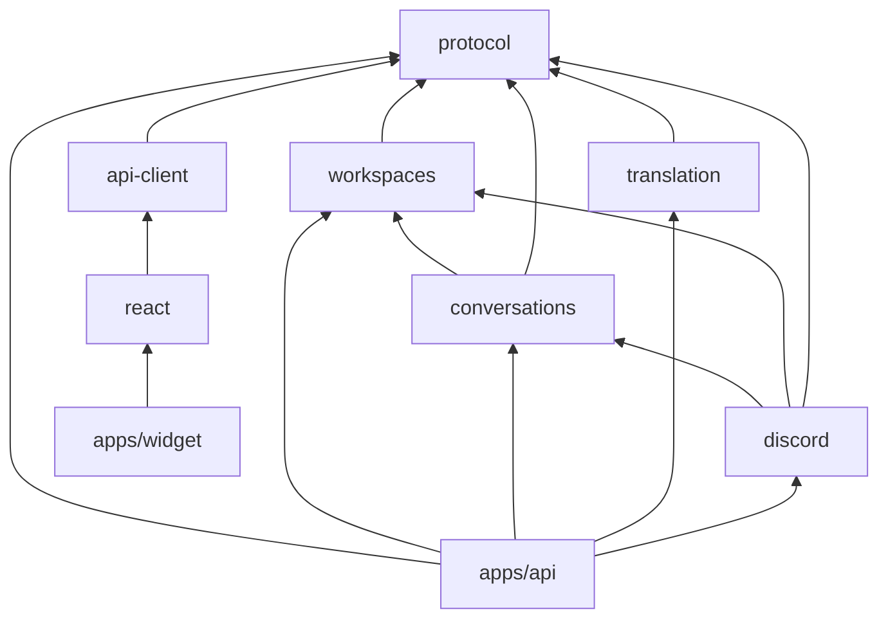
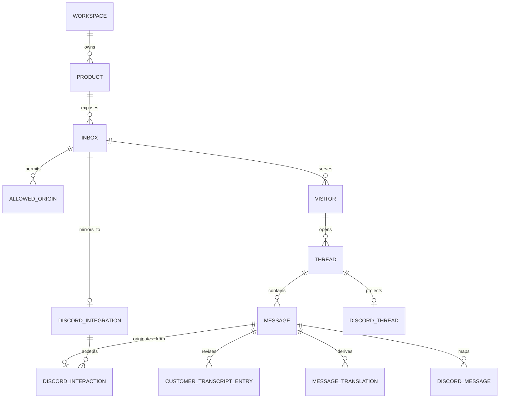

# RespondKit base architecture v1

Status: Implemented MVP foundation; external Gemini/Discord soak testing pending
Last updated: 2026-08-25
Scope: pnpm/TypeScript monorepo, React customer widget, D1 chat storage, Cloudflare Workflows, Gemini translation, and Discord as the complete operator interface

## Implemented decisions

This is the implementation architecture for the first Canto pilot.

1. Discord is the only operator UI. Operators reply with a guild-scoped `/reply message:<English text>` command inside the mapped support thread. Recovery-only `/status reference:<interaction ID>` and `/retry reference:<interaction ID> message:<original English text>` resolve rare ambiguous acceptances using the original idempotency key. There is no Better Auth dependency, magic-link flow, operator web app, or authenticated admin API.
2. Workspace, product, inbox, origin, and Discord-channel configuration live in D1 and are applied by a local Wrangler-authenticated bootstrap command.
3. Cloudflare Workflow creation is the durable acceptance boundary for messages. The API validates ingress and awaits an idempotent, deterministic `createBatch([one])` call before returning `202 Accepted` to the widget or `Queued` to Discord. The Workflow's first step idempotently writes the canonical message to D1.
4. D1 is the canonical transcript and product store after that first Workflow step. The customer widget uses optimistic updates plus a two-second cursor poll; there is no per-thread Durable Object or customer WebSocket.
5. V1 has no Queues, dead-letter queue, scheduled recovery job, transactional outbox, or Durable Object. Workflow supplies durable checkpoints and retries. Discord sends signed command interactions to the HTTP Worker, while outgoing forum/thread/message operations use Discord REST.
6. `apps/widget` is only a widget playground and E2E host. Canto imports `@respondkit/react` directly. Only `apps/widget` and `apps/api` build; functional packages export TypeScript source.

## Runtime architecture

```mermaid
flowchart LR
  Bootstrap[Local config bootstrap<br/>Wrangler-authenticated]

  subgraph Customer[Customer surface]
    Canto[Canto Transcriber]
    Widget[@respondkit/react]
    Canto --> Widget
  end

  subgraph ApiApp[apps/api — one Wrangler bundle]
    HTTP[Hono HTTP API<br/>validate + accept ingress]
    MessageWorkflow[[MessageWorkflow<br/>one instance per message]]
  end

  subgraph Cloudflare[Managed durable state]
    D1[(D1 canonical database)]
    WorkflowState[(Workflow checkpoints<br/>retries + instance history)]
  end

  Discord[Discord forum channel<br/>one post per support thread]
  Gemini[Gemini 3.1 Flash-Lite]

  Bootstrap -->|non-secret workspace topology| D1
  Widget -->|session + thread| HTTP
  Widget -->|send immutable ingress envelope| HTTP
  Discord -->|signed POST /reply interaction| HTTP
  HTTP -->|configuration + authorization reads| D1
  HTTP -->|await deterministic createBatch of one| MessageWorkflow
  HTTP -.->|202 Accepted after creation| Widget
  HTTP -.->|type 4 Queued after creation<br/>or Pending + status ref at cutoff| Discord
  MessageWorkflow <-->|checkpoint step state| WorkflowState
  MessageWorkflow -->|step 1: idempotent ingress upsert| D1
  MessageWorkflow <-->|context + results + business status| D1
  MessageWorkflow <-->|context-aware translation| Gemini
  MessageWorkflow -->|English customer projection via REST| Discord
  MessageWorkflow -->|Available audit via REST| Discord
  MessageWorkflow -.->|best-effort Failed audit via REST| Discord
  Widget -->|poll customer-visible messages| HTTP
```

The entire runtime is one Worker bundle plus managed D1 and Workflow state. `MessageWorkflow` is a named Worker entrypoint exported from `apps/api`; it is not a third deployed app or separately built package. The HTTP handler validates an immutable ingress envelope, derives stable IDs, awaits a single-item `createBatch`, and then acknowledges acceptance. Translation, canonical message insertion, and Discord REST delivery remain outside the request path.

Workflow creation, rather than D1 insertion, is intentionally the acceptance point. The accepted envelope is durable in Workflow state until its first step persists it. This removes the impossible-to-close dual-write gap that would exist if the handler committed D1 and then separately attempted to create a Workflow. D1 becomes authoritative as soon as step 1 completes, normally moments later; until then the widget retains its optimistic item.

Use the batch API even for one instance because [`createBatch`](https://developers.cloudflare.com/workflows/build/workers-api/) treats an existing instance ID as an idempotent skip, whereas `create()` throws on a duplicate. A new single-item call returns `[instance]`; a retained duplicate is skipped and returns `[]`, so the handler calls `get(id).status()` and reconciles it with D1 business/mapping state before describing the prior result. `queued`, `running`, or `waiting` remain accepted. `complete`, `errored`, or `terminated` never determine customer-facing wording alone: for example, `customer_available / audit_failed` means “Already available; Discord audit failed,” while a recorded pre-availability failure means “Not made available.” An errored/terminated instance with no D1 row is “Ingress failed.” This prevents an audit-only error from inviting a duplicate resend.

Customer instance IDs are a bounded hash of workspace, thread, and `client_message_id`; operator instance IDs derive from the Discord application and interaction ID. Each batch item uses `retention: { successRetention: "1 day", errorRetention: "3 days" }`. Workflow retention is not permanent deduplication, so D1 unique constraints remain authoritative after instance history expires. A `client_message_id` identifies one immutable payload: the first accepted payload wins, and the SDK never reuses that ID for edited text.

`DISCORD_BOT_TOKEN`, `GEMINI_API_KEY`, and the widget-token signing key are Worker secrets. `DISCORD_APPLICATION_ID` and `DISCORD_PUBLIC_KEY` are non-secret Worker configuration used to validate interactions. The bootstrap command never writes secrets into D1. Workflow parameters contain bounded text/context and future R2 object keys, never attachment bytes; both parameters and non-streaming step results stay below Cloudflare's 1 MiB limit.

## Discord: REST projection and signed HTTP interactions

Discord's bot REST API can manipulate forum posts, threads, and their messages:

| Operation | REST support |
| --- | --- |
| Create a forum post | Create a public thread and its starter message with `POST /channels/{forum_id}/threads`. |
| Read/update a thread | Get or patch its name, archived/locked state, slow mode, and applied tags. |
| Discover threads | List active guild threads and public/private/joined archived threads. |
| Read messages | Page 1–100 messages with `after`, `before`, or `around` cursors. |
| Reply | Treat the thread ID as a channel ID and post a message. Posting automatically unarchives an archived thread. |
| Edit/delete/react/pin | Edit bot-authored messages, delete with permission, and manage reactions or pins. |

See Discord's [thread model](https://docs.discord.com/developers/topics/threads), [channel/thread API](https://docs.discord.com/developers/resources/channel), and [message API](https://docs.discord.com/developers/resources/message).

### The `/reply` command

Register this as a guild-scoped Chat Input command so changes apply immediately:

```json
{
  "name": "reply",
  "type": 1,
  "description": "Reply to the customer in this support thread",
  "default_member_permissions": "0",
  "options": [
    {
      "name": "message",
      "description": "English reply to send to the customer",
      "type": 3,
      "required": true,
      "min_length": 1,
      "max_length": 6000
    }
  ]
}
```

`default_member_permissions: "0"` makes the command administrator-only by default. Discord Integration settings may later expose it to selected users or roles, but the Worker always enforces its own configured operator user/role allowlist.

The operator needs Use Application Commands and access to the thread. For REST projection, the bot needs View Channel, Send Messages on the forum (Discord ignores Create Public Threads for forum posts), Send Messages in Threads, and Read Message History for reconciliation. Add Reactions is granted only if used; Manage Threads is needed only for locked-thread recovery or moderation. No Gateway intents are required. See [Discord permissions](https://docs.discord.com/developers/topics/permissions).

For a forum post, the interaction's `channel_id` is the Discord thread ID. The handler requires an exact stored thread mapping and also validates the expected application, guild, public-thread channel type, forum `parent_id`, and operator user/roles. Invocations in the forum parent or an unmapped thread receive an ephemeral error.

The HTTP path is:

1. Start the three-second deadline timer as soon as the request arrives. Require `X-Signature-Ed25519` and `X-Signature-Timestamp`. Before JSON parsing, verify the hex-decoded signature against the exact UTF-8 bytes of `timestamp + unmodifiedRawBody`; missing, malformed, invalid, or requests outside a bounded freshness window (five minutes by default) return 401.
2. Answer Discord's signed `PING` with `PONG`.
3. Parse and authorize `/reply` against the stored application, guild, forum, thread, and operator allowlist. Normalize the command into an immutable operator-ingress envelope. The message ID and Workflow ID derive deterministically from the Discord interaction ID.
4. Await `MESSAGE_WORKFLOW.createBatch([{ id, params: envelope, retention }])`. A Discord retry with the same interaction ID targets the same instance. If the result is empty, load that retained instance's status. If the create response is ambiguous, repeat the idempotent call and reconcile that same ID before inviting another `/reply`; a new Discord interaction would have a new ID and could otherwise duplicate a reply whose first acceptance actually succeeded. No D1 message write, Gemini request, or outbound Discord REST call happens on this synchronous path.
5. Only after a new or existing actively processing instance is confirmed, return an ephemeral type-4 (`flags: 64`) “Queued” response within Discord's three-second deadline. Here, Queued means durably accepted for processing—not translated, available to the customer, delivered, or read. A retained terminal instance is worded from D1 state: Already available, Not made available, Audit failed, or Ingress failed.
6. The Workflow's first step idempotently inserts the interaction receipt, English operator message, and thread activity in one D1 batch. Permanent D1 uniqueness on the interaction and message IDs prevents a replay after Workflow retention expires.
7. After translation is durable and the reply is customer-visible, post a shared bot-authored “Available in chat” audit containing the exact customer-facing text. A pre-availability terminal failure records that the reply was not made available and attempts a best-effort shared failure audit; an audit-only failure never changes customer availability.

The cutoff covers signature verification, D1 authorization, duplicate-status reconciliation, and Workflow creation—not just the final binding call. Once a signature is valid, if any of those operations remains unresolved at the internal cutoff, return an ephemeral type-4 “Acceptance pending — do not resend yet” response containing the original Discord interaction ID as a stable status reference. The in-flight work may continue under [`ctx.waitUntil`](https://developers.cloudflare.com/workers/runtime-apis/context/#waituntil) and best-effort edit that response, but this continuation is not a second durable handoff. The token is held only by that continuation and is never written to D1 or Workflow parameters.

Register two recovery-only guild-scoped commands. `/status reference:<interaction ID>` revalidates the current application/guild/thread/operator, derives the original Workflow ID, reads its status plus D1 business/mapping state, and reports Processing, Already available, Audit failed, Not made available, or Not found. It never advises a fresh `/reply`, because that would have a new interaction ID and could race a late original acceptance.

`/retry reference:<interaction ID> message:<original English text>` derives the same original Workflow/message IDs. If the original instance is retained and errored, it restarts that instance only when D1 proves the reply is not customer-visible. If the instance is absent, it calls `createBatch` with the original ID and supplied immutable payload; if the original creation appears concurrently, one ID still admits only the first payload. If D1 says the reply is already available, retry is rejected with that exact status. Thus a lost continuation has a Discord-only recovery path without a Queue, outbox, timing assumption, or duplicate customer reply.

Discord message content is limited to 2,000 characters even though the command string option permits 6,000. Audit projection therefore uses deterministic chunks of at most 2,000 characters, each with its own deterministic nonce of at most 25 characters. Every forum starter, translated customer message, and audit receipt containing user-derived text sets `allowed_mentions: { parse: [] }`.

Pilot limitation: ambiguous Discord delivery reconciliation is deliberately bounded to one page of the newest 100 messages and to 50 active plus 50 archived forum-thread candidates. This is adequate for a monitored, low-volume Canto soak, but it is not permanent projection idempotency: a sufficiently delayed retry after enough forum traffic can miss the original projection and create a duplicate. Before production-scale use, paginate to a persisted time/snowflake boundary and persist a canonical projection content digest for comparison.

See Discord's [interaction overview](https://docs.discord.com/developers/interactions/overview), [receiving and responding rules](https://docs.discord.com/developers/interactions/receiving-and-responding), and [application-command schema](https://docs.discord.com/developers/interactions/application-commands). Cloudflare Web Crypto supports [Ed25519 verification](https://developers.cloudflare.com/workers/runtime-apis/web-crypto/).

Ordinary typed Discord messages, `@bot` mentions, edits, deletes, reactions, and manually created forum posts are deliberately not input surfaces in v1. Without a Gateway they are not observed or ingested by RespondKit. A future `/note` command, Reply button, or modal still works through the same HTTP interaction endpoint and does not require a socket.

## Why Workflow, and why no Queues or Durable Objects

Each accepted message is already a small durable state machine: persist, translate, project, and finalize. [Cloudflare Workflows](https://developers.cloudflare.com/workflows/) supplies checkpointed steps, persisted results, retries, timeouts, instance status, and manual restart directly, so v1 does not reproduce those mechanics in D1.

- The API awaits deterministic Workflow creation before claiming acceptance. There is no D1-to-Workflow dual write and therefore no launch outbox or scheduled re-driver.
- The first Workflow step uses `D1Database.batch()` to insert the original message plus thread/interaction state atomically. See [D1 batch](https://developers.cloudflare.com/d1/worker-api/d1-database/#batch).
- Later D1 steps store translations and business delivery state. There are no job leases, next-attempt timestamps, Queue acknowledgements, or DLQ rows. A narrow expiring compare-and-set claim exists only to ensure concurrent messages cannot both create the same Discord forum thread.
- A successful step result is checkpointed, but a step attempt may repeat before that checkpoint is recorded. Gemini, D1, and Discord operations therefore remain idempotent and reconcilable; Workflows do not make external effects exactly once. See [Workflow rules](https://developers.cloudflare.com/workflows/build/rules-of-workflows/).
- The Workflow wraps its normal graph in `try/catch`. After exhausted retries, stable failure steps record the stage-specific D1 state and attempt a best-effort Discord audit, then rethrow the original error so the instance remains `errored` and observable. Workflow history remains the operational retry trace rather than becoming the customer transcript.
- Every message has an opaque public ID, and every customer-observable state revision has a D1 `INTEGER PRIMARY KEY AUTOINCREMENT` cursor. The widget pages transcript events by `(thread_id, row_id)` and polls every two seconds only while visible.
- Discord operator input is an ordinary signed HTTP request. There is no long-lived socket, presence, sequence, or ephemeral shared state.

An ordinary message uses roughly six to nine billable steps—the first message pays the extra forum-claim/create/finalize steps—plus a step for each additional Discord chunk. The current Workers Paid allowance includes 500,000 Workflow steps per month, and Free includes 3,000 per day; Gemini and Discord costs are separate. Waiting and retry delays do not consume CPU. See [Workflow pricing](https://developers.cloudflare.com/workflows/reference/pricing/) and [limits](https://developers.cloudflare.com/workflows/reference/limits/).

Do not enable D1 read replication initially. If it is enabled later, use D1 Sessions/bookmarks to preserve sequential consistency. See [D1 read replication](https://developers.cloudflare.com/d1/best-practices/read-replication/).

### Later triggers for a Durable Object

Reconsider a DO only when one of these becomes a real requirement:

- ordinary Discord messages, mentions, edits, reactions, or manually created threads must become inputs, requiring a persistent Gateway connection;
- sub-second cross-client delivery, typing, or presence becomes a requirement;
- roughly 100+ simultaneously open widgets make two-second polling a material D1 baseline;
- multiple live responders need immediate exclusive ownership beyond a D1 conditional lease;
- a hot thread needs serialized ephemeral state shared by several clients.

D1 remains canonical even if a later DO provides coordination or realtime fanout.

## Monorepo and build boundary

```text
respondkit/
  apps/
    widget/                         Vite widget playground and browser/E2E host
      src/main.tsx                  mounts the real @respondkit/react package
      vite.config.ts
      package.json
    api/                            sole deployed Worker application
      src/index.ts                  default fetch + named MessageWorkflow export
      src/http.ts                   Hono route composition
      src/db.ts                     drizzle(env.DB)
      src/workflows/message.ts      WorkflowEntrypoint orchestration
      scripts/config-apply.ts       validates config and drives Wrangler D1
      scripts/discord-register.ts   registers guild application commands
      migrations/                   one reviewed D1 SQL ledger
      drizzle.config.ts
      vitest.config.ts
      worker-configuration.d.ts     generated Worker binding types
      wrangler.jsonc
      package.json
  packages/
    protocol/                       DTO/runtime schemas, events, IDs, errors
      src/index.ts
    api-client/                     source TypeScript customer fetch client
      src/index.ts
    react/                          customer widget components and hooks
      src/index.ts
      src/styles.css
    workspaces/                     workspace/product/inbox/origin component
      src/schema.ts
      src/index.ts
    conversations/                  visitor/thread/message/translation/status
      src/schema.ts
      src/index.ts
    translation/                    Gemini adapter, masking, prompt validation
      src/index.ts
    discord/                        Discord integration component
      src/commands.ts               canonical /reply command definition
      src/interactions.ts           signatures, parsing, authorization
      src/rest.ts                   thread/message REST adapter
      src/schema.ts                 integration and external-ID mappings
      src/index.ts
  apps/api/config/
    workspaces.example.json         non-secret topology template
  docs/
  package.json
  pnpm-workspace.yaml
  pnpm-lock.yaml
  tsconfig.base.json
```

Each directory under `packages/` has its own `package.json`, `tsconfig.json`, colocated tests, and public `src/index.ts`; repeated files are omitted from the tree for readability.

There is no `packages/auth`, generic `packages/database`, or `packages/workflow`. `apps/api` owns `drizzle(env.DB)`, Drizzle configuration, the checked-in D1 migration ledger, and the Cloudflare-specific Workflow entrypoint. Each persisted functional package owns its `schema.ts` and queries; the API's Drizzle config includes those schema paths. Workflow orchestration is application composition, not a reusable domain component.

`conversations.acceptCustomerIngress(db, input)` owns the idempotent first-step transaction for customer messages. For the cross-feature operator path, `discord.acceptReplyIngress(db, input)` owns the transaction: it combines its interaction-receipt statement with message/activity statements prepared by `conversations`, then executes one D1 batch. `apps/api` calls these services from named Workflow steps but never assembles feature persistence statements.

Workflow parameter schemas stay private to `apps/api`: they are internal immutable ingress envelopes, not public protocol. No feature package imports `cloudflare:workers`, `WorkflowEntrypoint`, the generated `Env`, or the `MESSAGE_WORKFLOW` binding. Every D1 or network side effect runs inside a stable named `step.do`; code outside steps only validates parameters and chooses the direction branch because it may replay.

The API's `wrangler.jsonc` has one same-script Workflow binding and no Queue consumer or scheduled trigger:

```jsonc
{
  "workflows": [
    {
      "name": "respondkit-message",
      "binding": "MESSAGE_WORKFLOW",
      "class_name": "MessageWorkflow"
    }
  ]
}
```

`src/index.ts` provides the default HTTP Worker export and re-exports the `MessageWorkflow` class by that exact name. Running `wrangler types` generates `worker-configuration.d.ts` from this configuration.

Only application packages expose `build`:

- `apps/widget` bundles a tiny page that mounts the real widget for development and E2E testing. It is not a dashboard and is not on Canto's production request path.
- `apps/api` lets Wrangler bundle the HTTP Worker and named `MessageWorkflow` entrypoint together.
- Feature packages are checked and tested directly by Vite+ from the workspace root, with no `build`, `dist`, or generated JavaScript.
- Canto consumes the publishable source packages (`protocol`, `api-client`, and `react`) and compiles them in its own Vite build.
- The root, both apps, and the server-only `workspaces`, `conversations`, `translation`, and `discord` packages are `private: true`. Only `protocol`, `api-client`, and `react` are publishable.

### Package dependency graph



`apps/api` is the composition root. Translation and Discord adapters do not orchestrate or import each other. `MessageWorkflow` invokes them in order, keeping feature dependencies acyclic and independently testable.

Private app/server edges use `workspace:*`. The publishable client chain uses `workspace:^` so pnpm rewrites it to caret semver ranges when packed. Public packages include their source so Canto can consume them outside this monorepo. An abridged but dependency-complete React manifest is:

```json
{
  "name": "@respondkit/react",
  "version": "0.1.0",
  "type": "module",
  "files": ["src/components", "src/lib", "src/widget", "src/index.ts", "src/styles.css"],
  "exports": {
    ".": {
      "types": "./src/index.ts",
      "default": "./src/index.ts"
    },
    "./styles.css": "./src/styles.css"
  },
  "dependencies": {
    "@respondkit/api-client": "workspace:^"
  },
  "peerDependencies": {
    "react": ">=18"
  },
  "scripts": { "test": "vp test" }
}
```

`@respondkit/api-client` likewise declares its direct `@respondkit/protocol` dependency; no package relies on a transitive import or workspace hoisting.

Use strict ESM TypeScript with `moduleResolution: "Bundler"`, `verbatimModuleSyntax`, and no emit. Do not use path aliases for package names; they can hide undeclared dependencies. Wrangler and Vite both follow the `.ts` exports and perform the only production builds. See [pnpm workspaces](https://pnpm.io/workspaces) and [Wrangler bundling](https://developers.cloudflare.com/workers/wrangler/bundling/).

## Workspace configuration without a control plane

Discord channel permissions are the human operator boundary; Cloudflare account access is the configuration boundary.

An idempotent local command such as `pnpm config:apply --env production` will:

1. validate a local non-secret config file with the same runtime schemas used by the API;
2. run the checked-in D1 migrations through Wrangler;
3. generate parameter-safe, idempotent seed SQL for the workspace, product, inbox, allowed origins, Discord guild/forum IDs, and allowed Discord user/role IDs;
4. execute that temporary SQL with `wrangler d1 execute --remote --file`;
5. print the public widget installation ID needed by Canto.

The Node script does not receive an `env.DB` binding. It reuses the config/domain schemas, then delegates remote database access to the Wrangler CLI authenticated by the developer's Cloudflare credentials. It does not create an unauthenticated admin HTTP route. Secrets are installed separately with `wrangler secret put` and local uncommitted dev vars.

`packages/discord/src/commands.ts` owns the canonical command definitions. The unbuilt `apps/api/scripts/config-apply.ts` and `discord-register.ts` run through `tsx`, declared by `apps/api`. The config script imports both workspace and Discord config schemas; the registration script applies guild-scoped commands through Discord REST using a local uncommitted bot token. These remain setup scripts, not another package or build target.

This is intentionally operationally simple for one owner while preserving the product model. A future control plane can retain the schema and validation model, then use the D1-bound workspace repository inside the Worker.

## D1 model



Key constraints:

- There are no user, session, account, verification, or workspace-membership tables in v1.
- Every product-owned row carries `workspace_id` directly or through an enforced composite relation. Worker queries never infer a workspace from untrusted client input.
- An inbox has an opaque public installation ID, allowed origins, and one Discord forum destination.
- Visitors store the app-supplied external user ID, email, PostHog distinct ID, locale, and bounded metadata. External user IDs are deliberately non-unique; only the opaque, inbox-scoped installation identity resumes an anonymous transcript. IP-derived region and user agent are observational context, not authentication.
- Client-supplied identity/context is advisory unless Canto later signs it server-side.
- `customer_transcript_entry.row_id` is the committed internal cursor; `message.id` is a public opaque ID.
- Each message stores its deterministic `workflow_instance_id`, direction, processing generation/status, and a bounded terminal failure code. Workflow history is temporary operational state, not transcript storage.
- The API stamps `accepted_at` and the stable message ID before Workflow creation. That server observation time is not part of immutable replay equality; duplicates return the first canonical timestamp. Each customer-observable `processing`, `available`, or `failed` transition appends an idempotent transcript revision keyed by `(message_id, processing_generation, event_kind)`. Clients page by revision `row_id`, merge repeated message IDs, and display by `(accepted_at, message.id)`, so both ordering and later state changes survive cursor advancement. Thread activity updates use the maximum canonical accepted timestamp rather than last-writer-wins.
- Unique `(thread_id, client_message_id)` deduplicates widget retries.
- Unique `(discord_integration_id, interaction_id)` deduplicates Discord interaction retries.
- Operator message and Workflow IDs derive from the interaction ID; conflict-safe inserts return the already accepted result on Discord retries and after Workflow retention expires.
- Discord interaction receipts retain the application, guild, thread, operator, command, and normalized option values, but never the short-lived interaction token.
- The unique `DISCORD_THREAD.thread_id` row doubles as the forum-creation claim. Its state is `claiming | ready`; `claim_owner`, `claim_expires_at`, and a deterministic correlation marker let one Workflow create/reconcile the forum post while concurrent instances retry the D1 compare-and-set. The owner renews before each bounded create attempt, and finalization stores the Discord thread ID only when the owner still matches. If an owner dies after Discord accepted the create, the next owner waits for expiry and reconciles the marker before creating anything.
- Discord message mappings retain deterministic nonce/correlation data, external IDs, and final projection status for ambiguous-response reconciliation.
- Unique `(message_id, target_language, prompt_version)` deduplicates translations.
- The Discord bot token and Gemini key never appear in these tables.

## Message Workflow contract

There is one `MessageWorkflow` class and one instance per customer message or operator reply. Its parameters are a private discriminated union:

- `customer_to_operator`: stable workspace/inbox/thread/message IDs, `client_message_id`, server-stamped acceptance time, original text, locale hint, and bounded provenance-labelled context;
- `operator_to_customer`: the same routing IDs and acceptance time plus Discord interaction/application/guild/thread/operator IDs and the normalized English command text.

The HTTP API validates authentication, Origin, routing, field sizes, and Discord authorization before creating an instance. Attachments are out of v1; a future envelope carries only finalized R2 object keys, never bytes. Step names and input values are deterministic so a restart follows the same graph. A duplicate widget request never echoes a newly supplied body as though it were canonical: it returns the stored message when available, or only the stable ID plus `already_accepted` while the first immutable payload is still in flight. An ambiguous widget acceptance returns `acceptance_unknown`; the SDK automatically repeats the same immutable request and `client_message_id`, never a new message ID.

Every network or D1 side effect occurs inside a named `step.do`. Successful step results are checkpointed. Because an attempt may still repeat before its success checkpoint, each step uses D1 upserts/unique keys or Discord reconciliation rather than assuming exactly-once execution. Adapters inspect HTTP responses and throw on retryable timeouts, `408`, `429`, and `5xx`; a resolved `fetch` alone does not trigger Workflow retry. Discord retries honor its bucket/global headers and `retry_after`, while other transient failures use bounded exponential backoff. Invalid input and permanent authorization/configuration failures throw `NonRetryableError` from inside the step. See [retry configuration](https://developers.cloudflare.com/workflows/build/sleeping-and-retrying/) and [Discord rate limits](https://docs.discord.com/developers/topics/rate-limits).

The first D1 step returns whether it inserted, resumed, or found a successfully terminal message. A newly recreated instance after Workflow retention expires exits immediately only when D1 says processing already succeeded. A manual restart of an errored retained instance may reopen `failed -> retrying` under an incremented processing generation; it replays idempotent steps and never mistakes a prior failure for success.

The normal graph is wrapped in a top-level `try/catch`. Its catch path runs stable `record-terminal-failure` and best-effort `post-failure-audit` steps, then rethrows the original error. If the failure audit itself cannot reach Discord, the D1 failure remains authoritative and the Workflow still ends errored. Failure is stage-specific: an operator reply that already became customer-visible remains `available` if only its Discord audit fails; it is not marked unsent or offered for resend.

Workflow instances are not serialized per support thread. The forum-creation claim prevents duplicate Discord threads, and accepted timestamps keep the transcript display deterministic, but v1 accepts that nearly simultaneous customer messages may be translated or projected to Discord in execution order and that one translation context may not yet contain another in-flight message. Strict cross-instance processing order would be a concrete reason to add a per-thread coordinator later.

### Step summary

| Stage | Customer to operator | Operator to customer | Durable result |
| --- | --- | --- | --- |
| Accept | Validate widget session/origin; create or reconcile deterministic instance | Verify signature/mapping/operator; create or reconcile deterministic instance | Non-failed Workflow instance is confirmed before HTTP acceptance |
| Persist ingress | Upsert original customer message and activity | Upsert interaction receipt, English reply, and activity | Original immutable message exists in D1 |
| Build context | Load bounded recent visible turns and language state | Load bounded recent visible turns and persisted customer language | Stable translation input is checkpointed |
| Translate | Gemini to English, or validated English pass-through | Gemini from English to customer language, or validated pass-through | Schema-validated translation result is checkpointed |
| Publish result | Store English translation | Store translation and atomically make reply customer-visible | Translation/business state exists in D1 |
| Project | Claim/find/create/finalize Discord thread, then post translated customer message | Post shared Available audit with exact customer-facing text | Discord IDs/status are reconciled into D1 |
| Finalize/fail | Mark projected; on failure record the stage and attempt a best-effort Discord audit | Preserve customer availability separately from audit status; pre-publish failure stays closed | Terminal business status exists in D1; Workflow rethrows terminal errors |

### Customer to Discord

```mermaid
sequenceDiagram
  autonumber
  participant Widget as React widget
  participant API as Hono API
  participant WF as MessageWorkflow
  participant D1 as D1
  participant Gemini as Gemini
  participant Discord as Discord REST

  Widget->>API: POST original text + client_message_id
  API->>D1: Validate token, inbox, thread, Origin
  API->>WF: await createBatch with deterministic customer ID
  WF-->>API: [instance] if created; [] if duplicate skipped
  opt Duplicate was skipped
    API->>WF: get(instance ID).status()
    WF-->>API: Existing status
    API->>D1: Reconcile business and Discord mapping state
    D1-->>API: Canonical stage-specific result if present
  end
  alt Non-failed acceptance confirmed
    API-->>Widget: 202 Accepted + stable message ID
  else Prior terminal state or still unknown
    API-->>Widget: Canonical stage result or acceptance_unknown
  end
  opt Workflow acceptance is or later becomes confirmed
    Note over API,WF: A created Workflow may begin before the HTTP response
    par Workflow processing
      WF->>D1: 1. persist-customer-ingress (idempotent batch)
      WF->>D1: 2. load-translation-context
      WF->>Gemini: 3. translate-to-english
      WF->>D1: 4. store-english-translation
      WF->>D1: 5. claim-or-load Discord thread mapping
      WF->>Discord: 6. create or reconcile forum thread if claim owner
      WF->>D1: 7. finalize thread mapping
      WF->>Discord: 8. bot REST post with nonce + reconciliation
      WF->>D1: 9. store message mapping, projected status, and customer revision
    and Widget polling independently
      loop While the panel is visible
        Widget->>API: cursor poll
        API->>D1: load canonical messages
        API-->>Widget: merge transcript revisions by message ID
      end
    end
  end
```

The forum starter is a context summary with a deterministic correlation marker; actual customer messages are separate Discord messages. This keeps one message-to-message mapping even for the first turn. Ordinary message sends use a deterministic Discord `nonce` with `enforce_nonce: true`. Thread creation has no equivalent nonce guarantee, so the ensure step searches recent threads for its correlation marker before retrying creation.

If translation or projection exhausts retries, the catch path records a terminal state in D1, then best-effort ensures/locates the Discord thread and posts the original plus a shared “Processing failed — retry needed” audit. It rethrows the original error so the Workflow is observably errored. It never discards or overwrites the customer's original text.

### Discord to customer

```mermaid
sequenceDiagram
  autonumber
  participant Simon as Simon in Discord
  participant Discord as Discord
  participant API as Signed interaction API
  participant WF as MessageWorkflow
  participant D1 as D1
  participant Gemini as Gemini
  participant Widget as React widget

  Simon->>Discord: Invoke /reply with English text
  Discord->>API: Signed interaction POST
  API->>D1: Validate mapping and operator allowlist
  API->>WF: await createBatch with deterministic interaction ID
  WF-->>API: [instance] if created; [] if duplicate skipped
  opt Duplicate was skipped
    API->>WF: get(instance ID).status()
    WF-->>API: Existing status
    API->>D1: Reconcile availability and Discord mapping state
    D1-->>API: Canonical stage-specific result if present
  end
  alt Acceptance confirmed before cutoff
    API-->>Discord: HTTP 200 type 4 ephemeral Queued
    Discord-->>Simon: Render Queued
  else Known terminal instance
    API-->>Discord: HTTP 200 type 4 with stage-specific result
    Discord-->>Simon: Render Available, Audit failed, or Not available
  else Acceptance unresolved at cutoff
    API-->>Discord: HTTP 200 type 4 Pending + interaction ID reference
    Discord-->>Simon: Render Pending; do not resend yet
    Note over API,Discord: Best-effort continuation may reconcile and PATCH the response
  end
  opt Pending response needs recovery
    Simon->>Discord: Invoke /status with interaction ID
    Discord->>API: Signed status interaction
    API->>WF: get(instance ID).status() if present
    API->>D1: Reconcile canonical business state
    API-->>Discord: Processing, Available, Failed, or Not found
    Discord-->>Simon: Render stage-specific status
    opt Same-reference retry is needed
      Simon->>Discord: Invoke /retry with reference + original English
      Discord->>API: Signed retry interaction
      API->>D1: Revalidate not already customer-visible
      API->>WF: Create or restart the original Workflow ID
      API-->>Discord: Queued or Already available
      Discord-->>Simon: Render retry result
    end
  end
  opt Workflow acceptance is or later becomes confirmed
    Note over API,WF: A created Workflow may begin before the interaction response
    par Workflow processing
      WF->>D1: 1. persist-operator-ingress (idempotent batch)
      WF->>D1: 2. load-language-and-context
      WF->>Gemini: 3. translate-to-customer-language
      WF->>D1: 4. publish-customer-visible-reply
      WF->>Discord: 5. bot REST Available audit with exact localized text
      Discord-->>Simon: Render shared Available audit
      WF->>D1: 6. mark-audit-projected
    and Widget polling independently
      loop While the panel is visible
        Widget->>API: cursor poll
        API->>D1: load messages after cursor
        API-->>Widget: localized operator replies and message-state revisions
      end
    end
  end
```

The D1 publish step atomically stores the translation and makes the reply visible to the customer. Outgoing translation fails closed: if translation exhausts retries before that step, the English reply is not exposed to a non-English customer. The failure path records the error and attempts a shared “Failed — reply was not made available in chat” audit. If only the later Discord audit fails, D1 remains `customer_available / audit_failed`; the customer-visible reply is not marked failed and Simon is not told to resend it. “Available in chat” means queryable by the widget, not fetched or read by the customer.

Ordinary messages typed into the Discord thread are not observed or ingested in v1.

The normal path is six to nine steps. Discord content over 2,000 characters adds one deterministic post step per chunk. Successful instances retain one day of Workflow history; errored instances retain three days for inspection and manual restart. Permanent transcript, translation, mapping, and terminal status always live in D1.

## API surface

Customer widget:

- `POST /v1/client/sessions`
- `POST /v1/threads`
- `GET /v1/threads/{threadId}/messages?after={cursor}`
- `POST /v1/threads/{threadId}/messages` — validates and reconciles deterministic Workflow creation; normally returns `202 Accepted`, while ambiguous/prior terminal outcomes return the same stable message ID with a stage-specific status

Discord/runtime:

- `POST /v1/discord/interactions` — signed `PING`, `/reply`, recovery-only `/status` and `/retry`, and later `/note`/button/modal ingress
- named `MessageWorkflow` entrypoint bound as `MESSAGE_WORKFLOW` inside the same Worker script
- local `pnpm discord:commands:apply` command registration script

There is no Queue consumer, scheduled handler, bespoke/admin operator API, or public Workflow-start endpoint. The publicly reachable Discord interaction endpoint accepts operator input only after Discord signature verification and configured guild/thread/user-or-role authorization. Workspace configuration happens through the local bootstrap command.

## Testing boundary

- Package unit tests run TypeScript directly with Vitest; no package build step.
- React uses Testing Library/jsdom, plus `apps/widget` for browser and CORS E2E tests.
- Translation fixtures cover Thai, Burmese Unicode, likely Zawgyi, protected URLs/code, ambiguous short messages, and failure behavior.
- API integration tests use Cloudflare's Vitest integration with the real checked-in D1 migration and local Workflow bindings. Tests cover the HTTP acceptance boundary, Workflow creation/replay, translation/projection paths, cursor revisions, and failure state without external credentials. See [Cloudflare's Workflow test APIs](https://developers.cloudflare.com/workers/testing/vitest-integration/test-apis/).
- Discord interaction tests cover raw-body signature rejection, signed `PING`, command parsing, guild/thread mapping, user/role authorization, duplicate interaction IDs, ambiguous acceptance reconciliation, retained stage-specific failures, Pending-reference `/status`, same-ID `/retry`, rejection after customer availability, and the three-second acknowledgement budget from request arrival.
- Discord REST contract tests cover rate limits, ambiguous success, deterministic nonce/correlation reconciliation, and visible receipt failure behavior.
- Workflow tests cover `createBatch`'s empty duplicate result plus status lookup, first-step D1 idempotency, immutable duplicate payloads, replay after instance retention, failure-generation restart, HTTP-status retry classification, outgoing fail-closed behavior, concurrent forum claims/expiry, Discord nonce/correlation reconciliation, audit-only failure, catch/rethrow terminal state, and final D1 state.
- CI runs package typechecks/tests, both app builds, and `wrangler deploy --dry-run`.

## Implementation status

The monorepo, source packages, API/Workflow composition, D1 model and migration, setup scripts, interaction-only Discord connector, Gemini adapter, and responsive React widget are implemented. Key-free unit, D1/Workflow integration, build, pack, and desktop/mobile browser tests form the automated gate.

The remaining pilot work requires separately provisioned development credentials: apply the real Canto/Discord topology, register the guild commands, run Thai and Burmese messages through Gemini and Discord, validate an English `/reply` back to each customer language, then integrate `@respondkit/react` into Canto behind a Crisp rollback switch. Attachments remain the first follow-on slice after this real-language soak test.
