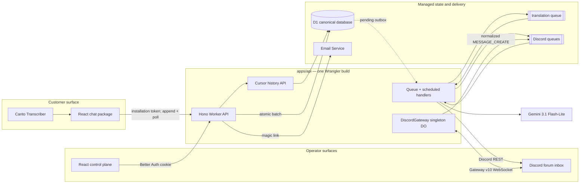
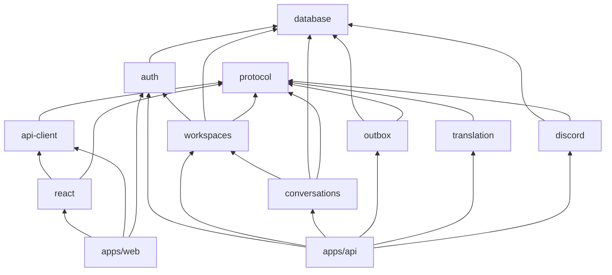
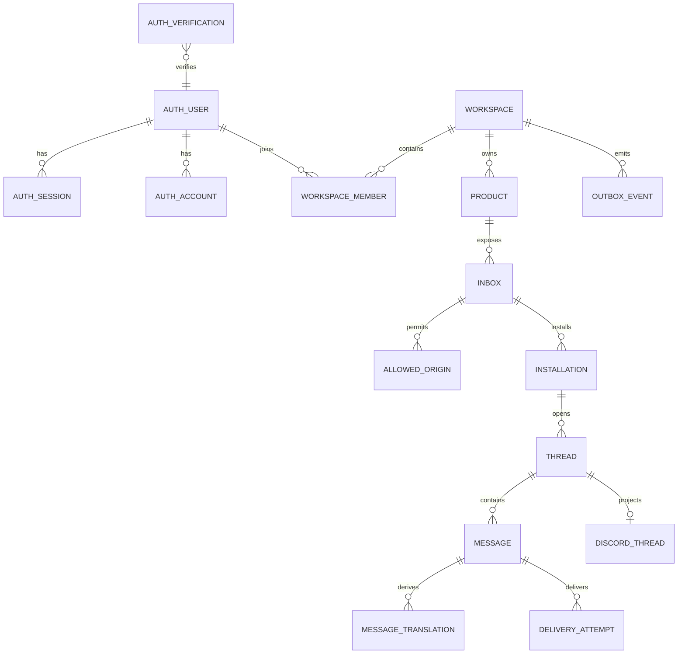

# Agent Chat base architecture v1

Status: proposal for review; no implementation started  
Last updated: 2026-08-25  
Scope: pnpm/TypeScript monorepo, workspace control plane, React widget, D1 chat storage, Gemini translation, and Discord operator inbox

## Decisions requested

This proposal makes five architectural choices:

1. D1 is the only source of truth for workspaces, sessions, threads, messages, translations, connector mappings, and the outbox.
2. The React widget uses optimistic updates plus a two-second D1 cursor poll while open. There is no per-thread Durable Object or customer WebSocket in v1.
3. One singleton `DiscordGateway` Durable Object is the narrow exception: it owns Discord's persistent outbound Gateway socket so ordinary forum-thread replies work without a third built application.
4. Better Auth owns operator identity/session only. Agent Chat owns `workspace` and `workspace_member`; the one-user launch is an admission/bootstrap policy rather than a database limitation.
5. Only `apps/web` and `apps/api` build. Every functional component is a source-only workspace package whose `package.json` exports TypeScript directly.

## Runtime architecture



The diagram has one business database and two compute concerns inside the API build:

- Stateless HTTP/Queue/scheduled handlers read and write D1.
- The singleton Gateway DO coordinates one Discord WebSocket. It does not store chat history or workspace data.

## Durable Object decision

### No Durable Object for chat data

D1 is sufficient for current chat volume:

- Each D1 database processes queries one at a time. Short indexed statements have ample capacity for an indie-scale support inbox. See [D1 limits and concurrency](https://developers.cloudflare.com/d1/platform/limits/).
- `D1Database.batch()` is transactional: statements execute sequentially and the whole batch rolls back if one fails. A message append can atomically insert the message, update its thread, and insert an outbox event. See [D1 batch](https://developers.cloudflare.com/d1/worker-api/d1-database/#batch).
- Every message gets an application-generated public ID and a D1 `INTEGER PRIMARY KEY AUTOINCREMENT` storage cursor. Clients page by `thread_id` plus this committed cursor; no read-then-write per-thread counter is needed.
- The widget polls `GET /messages?after=<cursor>` every two seconds while visible, then backs off while idle or hidden. Optimistic local echo makes the sender path immediate.
- Queues never define chat order. They are at-least-once and unordered; a consumer reloads authoritative D1 state and commits idempotently. See [Queue delivery guarantees](https://developers.cloudflare.com/queues/reference/delivery-guarantees/) and [Queue ordering](https://developers.cloudflare.com/queues/reference/how-queues-works/).

Do not enable D1 read replication initially. If it is enabled later, use D1 Sessions/bookmarks because replicas are asynchronous and normal reads are not guaranteed to observe the preceding write. See [D1 read replication](https://developers.cloudflare.com/d1/best-practices/read-replication/).

### One justified Durable Object: Discord Gateway

Normal text typed into a Discord forum thread arrives through `MESSAGE_CREATE` on the persistent Discord Gateway. HTTP interactions cover slash commands/components; Discord HTTP webhook events do not expose normal guild chat messages. See [Discord Gateway](https://docs.discord.com/developers/events/gateway), [threads](https://docs.discord.com/developers/topics/threads), [interactions](https://docs.discord.com/developers/interactions/receiving-and-responding), and [webhook events](https://docs.discord.com/developers/events/webhook-events).

A plain Worker-global WebSocket is not safe: Worker isolates are neither unique nor durable. With only two built applications, the smallest normal-reply design is one named `DiscordGateway` DO bundled by `apps/api`:

- exactly one Gateway session/socket for the bot;
- heartbeat and heartbeat-ACK monitoring;
- durable `session_id`, `resume_gateway_url`, and last sequence for resume;
- identify/resume/backoff handling;
- an alarm watchdog for deployment, eviction, or socket failure;
- normalized events published to a Queue, then idempotently ingested into D1;
- `GUILD_MESSAGES` and `MESSAGE_CONTENT` intents, with bot/webhook echo filtering.

Outbound DO WebSockets cannot hibernate, so this singleton accrues active duration and must reconnect after runtime replacement. Cloudflare documents both limitations; Discord's recurring events keep the object active during healthy operation, while persisted resume state and an alarm recover it. See [DO WebSockets](https://developers.cloudflare.com/durable-objects/best-practices/websockets/) and [DO lifecycle](https://developers.cloudflare.com/durable-objects/concepts/durable-object-lifecycle/).

Alternatives are materially worse for the stated requirements:

| Alternative | Consequence |
| --- | --- |
| No DO and no third runtime | Operator must use `/reply` or buttons instead of ordinary Discord messages. |
| Third `apps/discord-gateway` process | Correct, but introduces a third built/deployed application. |
| Cloudflare Container under `apps/api` | Adds a Docker artifact/runtime; Containers are themselves managed through Durable Objects. |
| Per-thread Durable Objects | Unnecessary for v1 storage/polling and duplicates D1 authority. |

Therefore this proposal says “no conversation Durable Objects,” not “no Durable Objects anywhere.” If the singleton Gateway DO proves operationally poor, replace only that connector runtime with a supervised process; the D1 and package model do not change.

### Later triggers for a thread/realtime DO

Add a hibernating WebSocket fanout DO only when measurements show one of these:

- a sub-second cross-client delivery SLA, typing, or presence becomes a product requirement;
- roughly 100+ simultaneously open widgets make two-second polling a material D1 baseline;
- multiple live responders require immediate exclusive ownership/handoff beyond a D1 conditional lease;
- a hot thread needs serialized ephemeral state shared by several clients.

Even then, D1 remains canonical and reconnect always cursor-syncs. A fanout DO is coordination, not another message database.

## Monorepo and build boundary

```text
agent-chat/
  apps/
    web/                 React/Vite control plane + widget demo
    api/                 Hono Worker, Queue/cron handlers, exported Gateway DO
  packages/
    protocol/            runtime schemas, DTOs, events, IDs, errors
    database/            D1 driver, Drizzle config, migration ledger
    auth/                Better Auth server/client/schema + magic-link policy
    workspaces/          workspace/member/product/inbox/origin services + schema
    conversations/       installation/thread/message/translation services + schema
    outbox/              transactional outbox schema and dispatch state machine
    translation/         Gemini masking, prompts, structured output, validation
    discord/             Gateway DO, REST, interactions, mapping/delivery schema
    api-client/          visitor and operator fetch clients
    react/               customer widget components/hooks
  docs/
  package.json
  pnpm-workspace.yaml
  pnpm-lock.yaml
  tsconfig.base.json
```

Only the application packages expose `build`:

- `apps/web`: Vite follows package exports and bundles React plus all browser-safe TypeScript sources.
- `apps/api`: Wrangler follows package exports and bundles the Hono Worker, Queue/scheduled entrypoints, and re-exported `DiscordGateway` class.
- Packages expose `typecheck` and `test`, but no `build`, `dist`, or generated JavaScript.

Wrangler bundles TypeScript and dependencies by default; keep bundling enabled. See [Wrangler bundling](https://developers.cloudflare.com/workers/wrangler/bundling/).

### Package dependency graph



`apps/api` is the composition root. Translation and Discord adapters do not call each other or orchestrate conversations. Queue handlers in the API invoke the feature packages in the required order, which keeps package dependencies acyclic and independently testable.

### Direct TypeScript exports

Every internal dependency uses `workspace:*`. Do not use TypeScript path aliases for package names because they can conceal undeclared dependencies. pnpm guarantees workspace resolution and rewrites the protocol when a package is packed. See [pnpm workspaces](https://pnpm.io/workspaces).

Representative package manifest:

```json
{
  "name": "@agent-chat/conversations",
  "private": true,
  "type": "module",
  "exports": {
    ".": {
      "types": "./src/index.ts",
      "default": "./src/index.ts"
    },
    "./schema": {
      "types": "./src/schema.ts",
      "default": "./src/schema.ts"
    }
  },
  "scripts": {
    "typecheck": "tsc --noEmit",
    "test": "vitest run"
  }
}
```

Additional rules:

- `moduleResolution: "Bundler"`, strict/no-emit TypeScript, ESM, and `verbatimModuleSyntax` in the shared base config.
- Web adds DOM libraries; Worker bindings/types stay out of browser packages.
- `@agent-chat/react` declares React as a peer dependency and explicitly exports its CSS if it has any.
- Browser/server subpaths remain separate, for example `@agent-chat/auth/client` and `@agent-chat/auth/server`.
- Runtime dependencies live in the app/package that imports them; do not depend on hoisting.
- The raw-TS React package is initially supported for Vite/bundler consumers such as Canto, not plain Node or every npm toolchain.
- `pnpm-workspace.yaml` enables one lockfile and rejects workspace cycles.

## Operator authentication and workspace model

Better Auth is an adapter inside `packages/auth`, instantiated per Worker request because D1 and Email Service are runtime bindings:

```text
createAuth({ db, baseURL, secret, allowedOperatorEmails, sendMagicLink })
```

Use `better-auth/minimal`, the extracted Drizzle adapter with SQLite provider, and the magic-link plugin. Better Auth documents both the [Drizzle adapter](https://better-auth.com/docs/adapters/drizzle) and [magic-link plugin](https://better-auth.com/docs/plugins/magic-link); Drizzle supports the [D1 driver](https://orm.drizzle.team/docs/sqlite/connect-cloudflare-d1).

V1 policy:

- `BOOTSTRAP_OPERATOR_EMAIL` or an allowlist controls who receives a link and who may be created.
- Unknown emails receive the same HTTP response but no email, avoiding account enumeration.
- Magic-link tokens are hashed, single-use, and stored with sessions in D1.
- Cloudflare Email Service sends the Better Auth-provided URL through a restricted send binding; never reconstruct or log the token. See Cloudflare's [magic-link example](https://developers.cloudflare.com/email-service/examples/email-sending/magic-link/).
- The first allowed login idempotently creates the default workspace and an owner membership. An authenticated request repairs missing membership if a post-auth hook previously failed.
- There is no database-level “only one user” constraint. Later invitations add memberships without replacing the auth or workspace model.
- Prefer the operator app and auth API on one origin. If split, use an exact trusted origin, credentialed CORS, secure cookies, and never `*`.
- Customer widget sessions are separate bearer tokens and never Better Auth cookies.

Do not use Better Auth's Organization plugin in v1. Its teams, invitations, and active-organization session coupling are broader than needed; Agent Chat workspaces are a product aggregate rather than an authentication feature.

## D1 model



Key constraints:

- Better Auth owns `user`, `session`, `account`, and `verification` tables generated for the exact pinned version/plugins.
- `workspace_member` has a unique `(workspace_id, user_id)` and role `owner | admin | member` even though v1 has one owner.
- Every product-owned row carries `workspace_id` directly or through an enforced composite key. Every operator query supplies the authenticated workspace ID.
- A product owns one or more inboxes. An inbox owns allowed widget origins and exactly one configured Discord forum destination in v1.
- Installations are anonymous customer identities; support contacts are a later extension. Their tokens are unrelated to operator sessions.
- `message.row_id` is the internal autoincrement cursor; `message.id` is the public opaque ID.
- Unique `(thread_id, client_message_id)` deduplicates widget retries.
- Unique `(discord_integration_id, external_message_id)` deduplicates Gateway resume/replay.
- Unique `(message_id, target_language, prompt_version)` deduplicates translations.
- Outbox events use deterministic IDs and states `pending | published | completed | dead`.

Feature packages own their Drizzle schema files. `packages/database/drizzle.config.ts` points to those schema paths and owns the one checked-in SQL migration ledger. This retains package ownership without constructing a runtime schema barrel or dependency cycle.

Schema workflow:

1. Pin Better Auth, its Drizzle adapter/CLI, Drizzle, and Wrangler exactly.
2. Use the matching Better Auth CLI to generate/update the auth Drizzle schema; do not hand-copy a stale schema.
3. Use Drizzle Kit to generate reviewed SQL across all feature schemas.
4. Use Wrangler to apply the same migration ledger locally, in preview, and remotely. Do not run a second production migration mechanism. Cloudflare supports ORM migration layouts through `migrations_dir` and `migrations_pattern`; see [D1 migrations](https://developers.cloudflare.com/d1/reference/migrations/).

## Message flows

### Customer to Discord

1. The widget posts text with an installation token and `client_message_id`.
2. The API validates inbox/origin/token and generates message/outbox IDs.
3. One D1 batch inserts the original, updates thread activity, and inserts `customer-message.translate` into the outbox.
4. The request returns the committed message immediately. `waitUntil` attempts Queue publication; a scheduled re-driver republishes stranded pending outbox rows.
5. The translation consumer reloads the authoritative message plus bounded context, calls Gemini, and validates protected tokens/structured output.
6. One D1 batch inserts the English translation and a Discord-delivery outbox event.
7. The Discord consumer creates or locates the forum thread, posts through REST, and commits external IDs/delivery status idempotently.
8. The widget poll sees any resulting state through the monotonic cursor.

### Discord to customer

1. `DiscordGateway` receives an authorized human `MESSAGE_CREATE`, rejects bots/webhooks/unmapped channels, and publishes a normalized inbound event.
2. The Queue consumer deduplicates the Discord message ID and atomically appends the English operator message plus translation outbox event in D1.
3. The translation consumer translates to the thread's persisted customer language and validates protected tokens.
4. D1 commits the translated variant and delivery state.
5. The open widget discovers the reply on its next cursor poll. Discord receives a REST reaction/receipt showing the exact delivered text.

The Queue payload is a reference or bounded normalized event, never the authority. Queue acknowledgements happen only after the resulting database state is durable.

## API surface

Operator/control plane:

- `/api/auth/*` — Better Auth handler
- `GET /v1/workspaces/current`
- `GET/PATCH /v1/workspaces/{workspaceId}`
- `GET/POST /v1/workspaces/{workspaceId}/products`
- `GET/POST/PATCH /v1/products/{productId}/inboxes`
- `PUT /v1/inboxes/{inboxId}/origins`
- `PUT /v1/inboxes/{inboxId}/discord`

Customer widget:

- `POST /v1/client/sessions`
- `POST /v1/threads`
- `GET /v1/threads/{threadId}/messages?after={cursor}`
- `POST /v1/threads/{threadId}/messages`

Internal handlers:

- Queue dispatch by queue/event type inside `apps/api`
- scheduled outbox re-driver and cleanup
- Discord interactions route with Ed25519 verification
- `DiscordGateway` DO export and alarm lifecycle

The operator session does not authorize widget endpoints; the widget token cannot call workspace/operator endpoints.

## Testing boundary

- Package unit tests run directly against TypeScript with Vitest; no package build step.
- React uses Testing Library/jsdom for widget state and accessibility.
- Translation fixtures cover Thai, Burmese Unicode, likely Zawgyi, protected URLs/code, ambiguous short messages, and failure behavior.
- API integration tests use Cloudflare's Vitest pool with real D1 migrations, Queue handlers, and a Gateway DO stub rather than mocked SQL. See [Cloudflare Vitest APIs](https://developers.cloudflare.com/workers/testing/vitest-integration/test-apis/).
- Contract tests parse API payloads through `@agent-chat/protocol` on both client and server.
- CI runs package typechecks/tests, the two app builds, and `wrangler deploy --dry-run` for the API bundle.

## Proposed implementation sequence after approval

1. Scaffold pnpm, shared TypeScript/tooling, all source package manifests, and the two application entrypoints.
2. Add D1/Drizzle migrations, Better Auth magic link, default workspace bootstrap, and a minimal control-plane screen.
3. Add installation/thread/message APIs plus the React widget with optimistic append and cursor polling.
4. Add outbox/Queue handling and Gemini translation.
5. Add Discord REST mapping, the singleton Gateway DO, ordinary replies, and recovery tests.
6. Integrate the package into Canto behind a Crisp rollback switch.

No implementation should begin until the reviewer accepts or changes the singleton Gateway DO, polling, workspace/auth ownership, and source-only package graph above.
