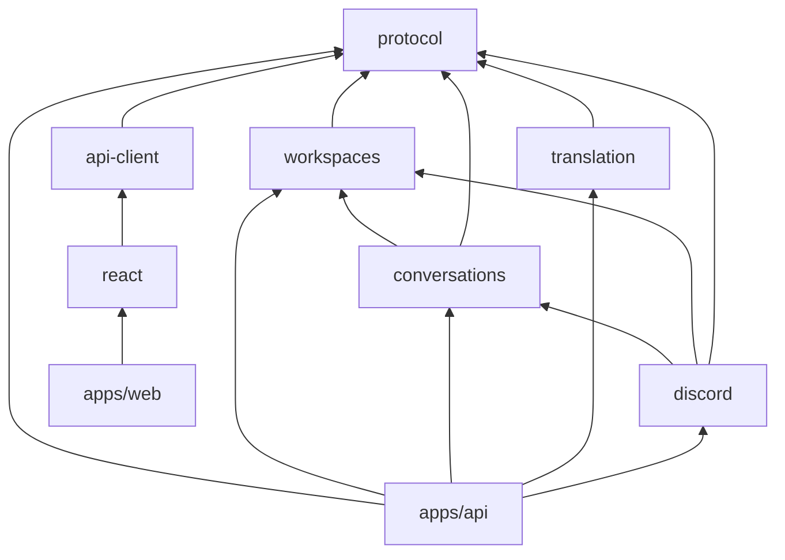
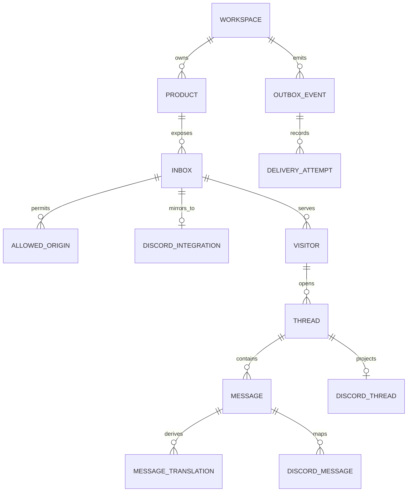

# Agent Chat base architecture v1

Status: revised proposal for review; no implementation started
Last updated: 2026-08-25
Scope: pnpm/TypeScript monorepo, React customer widget, D1 chat storage, Gemini translation, and Discord as the complete operator interface

## Decisions requested

This revision removes operator authentication and the control plane entirely.

1. Discord is the only operator UI. There is no Better Auth dependency, magic-link flow, operator web app, or authenticated admin API in v1.
2. Workspace, product, inbox, origin, and Discord-channel configuration live in D1 and are applied by a local Wrangler-authenticated bootstrap command.
3. D1 is the canonical store. The customer widget uses optimistic updates plus a two-second cursor poll; there is no per-thread Durable Object or customer WebSocket.
4. One named `DiscordGateway` Durable Object is the narrow exception. It maintains the bot's one outbound Discord Gateway socket so ordinary messages typed in Discord arrive promptly.
5. `apps/web` is only a widget playground and E2E host. Canto imports `@agent-chat/react` directly. Only `apps/web` and `apps/api` build; functional packages export TypeScript source.

## Runtime architecture

```mermaid
flowchart LR
  Bootstrap[Local config bootstrap<br/>Wrangler-authenticated]

  subgraph Customer[Customer surface]
    Canto[Canto Transcriber]
    Widget[@agent-chat/react]
    Canto --> Widget
  end

  subgraph ApiApp[apps/api — one Wrangler bundle]
    HTTP[Hono HTTP API]
    Jobs[Queue consumers +<br/>scheduled outbox re-driver]
    Gateway[DiscordGateway DO<br/>one named instance]
  end

  subgraph Cloudflare[Managed data and delivery]
    D1[(D1 canonical database)]
    Queues[[Cloudflare Queues]]
  end

  Discord[Discord forum channel<br/>one post per support thread]
  Gemini[Gemini 3.1 Flash-Lite]

  Bootstrap -->|non-secret workspace topology| D1
  Widget -->|append + cursor poll| HTTP
  HTTP -->|transactional batch| D1
  HTTP -.->|publish committed outbox reference| Queues
  D1 -.->|re-drive pending outbox| Jobs
  Queues --> Jobs
  Jobs <-->|messages + translations| D1
  Jobs <-->|context-aware translation| Gemini
  Jobs -->|create thread; post/edit/react via REST| Discord
  Jobs -->|scheduled ensureConnected watchdog| Gateway
  Discord <-->|Gateway v10 WebSocket; MESSAGE_CREATE| Gateway
  Gateway -->|normalized inbound event| Queues
```

The `DiscordGateway` class is exported from the same `apps/api` Worker bundle. A Durable Object is a separately managed runtime instance, but it is not a third source package, build, container, or deployment pipeline.

`DISCORD_BOT_TOKEN`, `GEMINI_API_KEY`, and the widget-token signing key are Worker secrets. The bootstrap command never writes them into D1.

## Discord: REST control, Gateway notification

Discord's bot REST API can manipulate forum posts, threads, and their messages:

| Operation | REST support |
| --- | --- |
| Create a forum post | Create a public thread and its starter message with `POST /channels/{forum_id}/threads`. |
| Read/update a thread | Get or patch its name, archived/locked state, slow mode, and applied tags. |
| Discover threads | List active guild threads and public/private/joined archived threads. |
| Read messages | Page 1–100 messages with `after`, `before`, or `around` cursors. |
| Reply | Treat the thread ID as a channel ID and post a message. Posting automatically unarchives an archived thread. |
| Edit/delete/react/pin | Edit bot-authored messages, delete with permission, and manage reactions or pins. |

See Discord's [thread model](https://docs.discord.com/developers/topics/threads), [channel/thread API](https://docs.discord.com/developers/resources/channel), and [message API](https://docs.discord.com/developers/resources/message).

REST does **not** notify the bot that an operator typed an ordinary message. That event is `MESSAGE_CREATE` on the [Discord Gateway](https://docs.discord.com/developers/events/gateway-events#message-create):

- Incoming Discord webhooks can send messages but cannot listen to a channel.
- Discord's current [HTTP Event Webhooks](https://docs.discord.com/developers/events/webhook-events#event-types) do not expose guild/channel `MESSAGE_CREATE`.
- HTTP interactions notify the Worker only when the operator explicitly invokes a slash command, message command, button, or modal.
- Discord explicitly notes that a thread's `last_message_id` changing does not emit `THREAD_UPDATE`; consumers should listen for Message Create.

Therefore a WebSocket is required for **prompt ordinary free-text replies**. It is not required if we accept one of these degraded modes:

| Mode | Trade-off |
| --- | --- |
| `/reply` interaction only | Pure HTTP and cheap, but Discord no longer feels like a normal inbox. |
| Poll every mapped thread with REST | Works as recovery or a tiny prototype, but latency and request volume scale with the number of open threads. |
| Supervised gateway process | Correct, but adds a separately operated long-lived artifact/runtime. A Cloudflare Container can share the Wrangler project, but still introduces Docker/container operations and is itself DO-backed. |

At a two-second interval, 20 open threads require about 10 empty-or-not REST requests per second; 100 threads consume Discord's documented 50 requests/second global bot ceiling before any sends or other calls. Per-route buckets also vary and must be learned from response headers. See [Discord rate limits](https://docs.discord.com/developers/topics/rate-limits). REST polling remains useful as occasional reconciliation using `after=<last_discord_message_id>`, not as the primary inbox transport.

## Durable Object decision and cost

### No Durable Object for chat data

D1 is sufficient for the base product:

- `D1Database.batch()` atomically inserts a message, updates its thread, and inserts an outbox event. See [D1 batch](https://developers.cloudflare.com/d1/worker-api/d1-database/#batch).
- Every message has an opaque public ID and a D1 `INTEGER PRIMARY KEY AUTOINCREMENT` storage cursor. Clients page by `(thread_id, row_id)`; no read-then-write thread counter is needed.
- The widget polls every two seconds only while open and visible, then backs off. Optimistic local echo makes the sender path immediate.
- Queues are at-least-once and unordered. Consumers reload D1 state and use deterministic IDs/unique constraints, so Queue delivery never defines message order. See [Queue delivery guarantees](https://developers.cloudflare.com/queues/reference/delivery-guarantees/).

Do not enable D1 read replication initially. If it is enabled later, use D1 Sessions/bookmarks to preserve sequential consistency. See [D1 read replication](https://developers.cloudflare.com/d1/best-practices/read-replication/).

### One justified Durable Object: Discord Gateway

A normal Worker isolate cannot safely own the Gateway connection: isolates are neither singleton nor durable. One named DO provides:

- one authoritative Gateway-session owner for one bot token across every product/inbox;
- heartbeat and ACK monitoring;
- persisted `session_id`, `resume_gateway_url`, and last sequence number;
- identify/resume, invalid-session, reconnect, and exponential-backoff handling;
- an in-memory heartbeat timer and a coarse durable alarm watchdog;
- a tiny DO-SQLite delivery spool written before Queue publication and deleted after Queue acceptance;
- normalized spooled events published to a Queue, then idempotently inserted into D1;
- the `GUILDS`, `GUILD_MESSAGES`, and privileged `MESSAGE_CONTENT` Gateway intents;
- View Channel, Read Message History, Send Messages, Send Messages in Threads, and Add Reactions permissions, with manage permissions granted only if used;
- configured guild/forum/operator checks, plus separate treatment of operator, self-bot, other-bot, and webhook events.

The DO owns coordination, resume state, and only a transient unacknowledged-event spool. It never becomes the message database. For a relevant dispatch, one DO-SQLite transaction stores the normalized event and its Gateway sequence before Queue publication; resume never advances past an event that lacks a durable handoff. Queue acceptance followed by a crash may duplicate an event, which the D1 external-message constraint absorbs.

The API's scheduled handler must invoke `env.DISCORD_GATEWAY.getByName("primary").ensureConnected()` after deploy and periodically thereafter: exporting a DO class does not instantiate it, and its first alarm cannot exist before its first invocation. Cloudflare can restart it, so reconnection is part of normal behavior rather than an exceptional case. See the [Durable Object lifecycle](https://developers.cloudflare.com/durable-objects/concepts/durable-object-lifecycle/) and [Discord heartbeat protocol](https://docs.discord.com/developers/events/gateway#heartbeat-interval).

### Cost estimate

Cloudflare allocates and bills each DO as 128 MB (`0.128 GB`) while active. An outbound socket alone prevents eviction for at most 15 minutes; after that, normal inactivity rules resume. Discord's heartbeat timer and recurring ACK/events should keep this object active during a healthy session, but it is not an immortal process. Conservatively use a fully active month as the cost ceiling:

```text
30 days × 24 hours × 3,600 seconds × 0.128 GB
= 331,776 GB-s per month
```

Current [Durable Objects pricing](https://developers.cloudflare.com/durable-objects/platform/pricing/) and [Workers pricing](https://developers.cloudflare.com/workers/platform/pricing/) imply:

| Scenario | Approximate monthly implication |
| --- | ---: |
| Already on Workers Paid, DO inclusion otherwise unused | **$0 incremental**; 331,776 GB-s fits within the included 400,000 GB-s. |
| This gateway is the reason to upgrade | **$5 total account minimum**, not $5 per workspace. |
| Free tier | Technically $0: one active DO uses about 11,059 of the 13,000 GB-s daily allowance, but only ~15% headroom remains; not recommended for production. |
| Included DO usage already exhausted | Up to about **$12.65 incremental** for this usage shape because duration and request overage are rounded in million-unit steps. |

Request volume is also comfortably inside the Paid plan's included one million DO requests. A 45-second illustrative heartbeat produces about 57,600 ACK frames in 30 days, or roughly 2,880 request equivalents if Cloudflare applies its generic 20-incoming-WebSocket-messages-to-one-request rule to frames received on an outbound socket. A five-minute watchdog adds 8,640 alarm invocations and the same number of tiny SQLite alarm-row writes; an equally frequent external `ensureConnected()` check adds at most another 8,640 DO calls. Even counting every ACK one-for-one would remain far below the included request and write volume. The resume/spool storage is negligible at this scale.

The cost advantage depends on **one bot token and one named Gateway DO across all products**. A second continuously active bot/DO would bring duration to about 663,552 GB-s and could trigger the first $12.50 duration-overage block. Product isolation belongs in D1 routing and agent configuration, not in separate Discord bot processes unless that isolation is later worth the cost.

This is the concrete case for a Durable Object. Per-thread DOs still have no justification in v1.

### Later triggers for customer realtime DOs

Add hibernating customer WebSocket fanout only if measurements show one of these:

- sub-second cross-client delivery, typing, or presence becomes a requirement;
- roughly 100+ simultaneously open widgets make two-second polling a material D1 baseline;
- multiple live responders need immediate exclusive ownership beyond a D1 conditional lease;
- a hot thread needs serialized ephemeral state shared by several clients.

D1 remains canonical, and reconnect always performs a cursor sync.

## Monorepo and build boundary

```text
agent-chat/
  apps/
    web/                 Vite widget playground, visual fixture, and E2E host only
    api/                 Hono Worker, Queue/cron handlers, exported Gateway DO
  packages/
    protocol/            runtime schemas, DTOs, events, IDs, and errors
    api-client/          source TypeScript customer fetch client
    react/               customer widget components and hooks
    workspaces/          workspace/product/inbox/origin schema and services
    conversations/       visitor/thread/message/translation schema and services
    translation/         Gemini masking, prompt, structured-output validation
    discord/             Gateway DO, REST adapter, mapping and delivery schema
  config/                non-secret workspace topology templates
  docs/
  package.json
  pnpm-workspace.yaml
  pnpm-lock.yaml
  tsconfig.base.json
```

There is no `packages/auth`. There is also no generic `packages/database`: `apps/api` owns `drizzle(env.DB)`, Drizzle configuration, and the checked-in D1 migration ledger. Each functional package owns its `schema.ts` and queries; the API's Drizzle config includes those schema paths. The transactional outbox is part of `conversations`, because message mutation and event creation must be one feature-owned D1 batch rather than a transaction leaked into the composition root.

Only application packages expose `build`:

- `apps/web` bundles a tiny page that mounts the real widget for development and E2E testing. It is not a dashboard and is not on Canto's production request path.
- `apps/api` lets Wrangler bundle the HTTP, Queue, scheduled, and DO entrypoints together.
- Feature packages expose `typecheck` and `test`, but no `build`, `dist`, or generated JavaScript.
- Canto consumes the publishable source packages (`protocol`, `api-client`, and `react`) and compiles them in its own Vite build.

### Package dependency graph



`apps/api` is the composition root. Translation and Discord adapters do not orchestrate each other. Queue handlers invoke packages in the required order, keeping feature dependencies acyclic and independently testable.

Every internal dependency uses `workspace:*`. Public packages are published with their source included so Canto can consume them outside this monorepo. An abridged but dependency-complete React manifest is:

```json
{
  "name": "@agent-chat/react",
  "version": "0.1.0",
  "type": "module",
  "files": ["src"],
  "exports": {
    ".": {
      "types": "./src/index.ts",
      "default": "./src/index.ts"
    },
    "./styles.css": "./src/styles.css"
  },
  "dependencies": {
    "@agent-chat/api-client": "workspace:^"
  },
  "peerDependencies": {
    "react": ">=18"
  },
  "scripts": {
    "typecheck": "tsc --noEmit",
    "test": "vitest run"
  }
}
```

`@agent-chat/api-client` likewise declares its direct `@agent-chat/protocol` dependency; no package relies on a transitive import or workspace hoisting.

Use strict ESM TypeScript with `moduleResolution: "Bundler"`, `verbatimModuleSyntax`, and no emit. Do not use path aliases for package names; they can hide undeclared dependencies. Wrangler and Vite both follow the `.ts` exports and perform the only production builds. See [pnpm workspaces](https://pnpm.io/workspaces) and [Wrangler bundling](https://developers.cloudflare.com/workers/wrangler/bundling/).

## Workspace configuration without a control plane

Discord channel permissions are the human operator boundary; Cloudflare account access is the configuration boundary.

An idempotent local command such as `pnpm config:apply --env production` will:

1. validate a local non-secret config file with the same runtime schemas used by the API;
2. run the checked-in D1 migrations through Wrangler;
3. generate parameter-safe, idempotent seed SQL for the workspace, product, inbox, allowed origins, Discord guild/forum IDs, and allowed Discord user/role IDs;
4. execute that temporary SQL with `wrangler d1 execute --remote --file`;
5. print the public widget installation ID needed by Canto.

The Node script does not receive an `env.DB` binding. It reuses the config/domain schemas, then delegates remote database access to the Wrangler CLI authenticated by the developer's Cloudflare credentials. It does not create an unauthenticated admin HTTP route. Secrets are installed separately with `wrangler secret put` and local uncommitted dev vars.

This is intentionally operationally simple for one owner while preserving the product model. A future control plane can retain the schema and validation model, then use the D1-bound workspace repository inside the Worker.

## D1 model



Key constraints:

- There are no user, session, account, verification, or workspace-membership tables in v1.
- Every product-owned row carries `workspace_id` directly or through an enforced composite relation. Worker queries never infer a workspace from untrusted client input.
- An inbox has an opaque public installation ID, allowed origins, and one Discord forum destination.
- Visitors store the app-supplied external user ID, email, PostHog distinct ID, locale, and bounded metadata. IP-derived region and user agent are observational context, not authentication.
- Client-supplied identity/context is advisory unless Canto later signs it server-side.
- `message.row_id` is the committed internal cursor; `message.id` is a public opaque ID.
- Unique `(thread_id, client_message_id)` deduplicates widget retries.
- Unique `(discord_integration_id, external_message_id)` deduplicates Gateway resume/replay.
- Unique `(message_id, target_language, prompt_version)` deduplicates translations.
- Outbox events have deterministic IDs and states `pending | published | completed | dead`.
- The Discord bot token and Gemini key never appear in these tables.

## Message flows

### Customer to Discord

1. Canto supplies product context to the widget; the widget exchanges its public installation ID and allowed Origin for a short-lived, inbox-bound customer token.
2. The widget posts original text with that token and a `client_message_id`.
3. One D1 batch inserts the message, advances thread activity, and inserts a translation outbox event.
4. The API returns the committed message immediately. `waitUntil` publishes a reference to a Queue; a scheduled re-driver catches any stranded outbox row.
5. The translation consumer reloads bounded thread context, calls Gemini, validates protected URLs/code/identifiers, and stores the English variant.
6. The Discord consumer creates or locates the mapped forum thread and posts the translated English message through REST. Normal message sends use a deterministic Discord `nonce` with `enforce_nonce: true`; ambiguous responses are reconciled before retry.
7. Forum-thread creation has no equivalent nonce guarantee, so the starter message carries a deterministic correlation marker. A delivery lease plus recent-thread reconciliation finds a success whose HTTP response was lost before creating another post.
8. The widget cursor poll observes resulting delivery state.

### Discord to customer

1. Simon types an ordinary English reply in the mapped Discord thread.
2. `DiscordGateway` receives `MESSAGE_CREATE`. It rejects unmapped or unauthorized operator input, but first uses self-authored bot events and their nonces to reconcile outbound deliveries; other bots and webhooks are excluded from operator-message ingestion.
3. A Queue consumer deduplicates the Discord message ID and atomically stores the English operator message plus a translation outbox event in D1.
4. Gemini translates it to the thread's persisted customer language and the consumer stores the translated variant.
5. The open widget discovers the reply on its next cursor poll. The bot adds a Discord reaction or receipt only after the exact customer-facing text is durable.

Queue payloads are references or bounded normalized events, never the authority. Consumers acknowledge only after resulting D1 state is durable.

## API surface

Customer widget:

- `POST /v1/client/sessions`
- `POST /v1/threads`
- `GET /v1/threads/{threadId}/messages?after={cursor}`
- `POST /v1/threads/{threadId}/messages`

Discord/runtime:

- `POST /v1/discord/interactions` for future slash commands and operation notes, with Ed25519 verification
- Queue consumers selected by queue/event type inside `apps/api`
- scheduled outbox re-driver and retention cleanup
- exported `DiscordGateway` DO class and alarm lifecycle

There are no auth, workspace CRUD, or operator-message HTTP endpoints. Workspace configuration happens through the local bootstrap command, and operator replies enter through the configured Discord channel.

## Testing boundary

- Package unit tests run TypeScript directly with Vitest; no package build step.
- React uses Testing Library/jsdom, plus `apps/web` for browser and CORS E2E tests.
- Translation fixtures cover Thai, Burmese Unicode, likely Zawgyi, protected URLs/code, ambiguous short messages, and failure behavior.
- API integration tests use Cloudflare's Vitest pool with real D1 migrations, Queue handlers, and the named Gateway DO. See [Cloudflare's Vitest integration](https://developers.cloudflare.com/workers/testing/vitest-integration/test-apis/).
- Discord contract tests cover REST rate limits, ambiguous REST success, nonce/correlation reconciliation, Gateway identify/resume/replay, duplicate `MESSAGE_CREATE`, reconnect backoff, and unauthorized/bot messages.
- CI runs package typechecks/tests, both app builds, and `wrangler deploy --dry-run`.

## Proposed implementation sequence after approval

1. Scaffold pnpm, shared TypeScript/tooling, the source package manifests, `apps/web`, and `apps/api`.
2. Add feature-owned Drizzle schemas, reviewed D1 migrations, and the local workspace bootstrap command.
3. Add customer-session/thread/message APIs and the React widget with optimistic append and cursor polling.
4. Add the transactional outbox, Queue consumers, and Gemini translation.
5. Add Discord REST projection, then the singleton Gateway DO and ordinary Discord replies.
6. Integrate `@agent-chat/react` into Canto behind a Crisp rollback switch.

Implementation should begin after review accepts the one Gateway DO, D1 polling model, Discord-only operations, and source-only package boundary.
